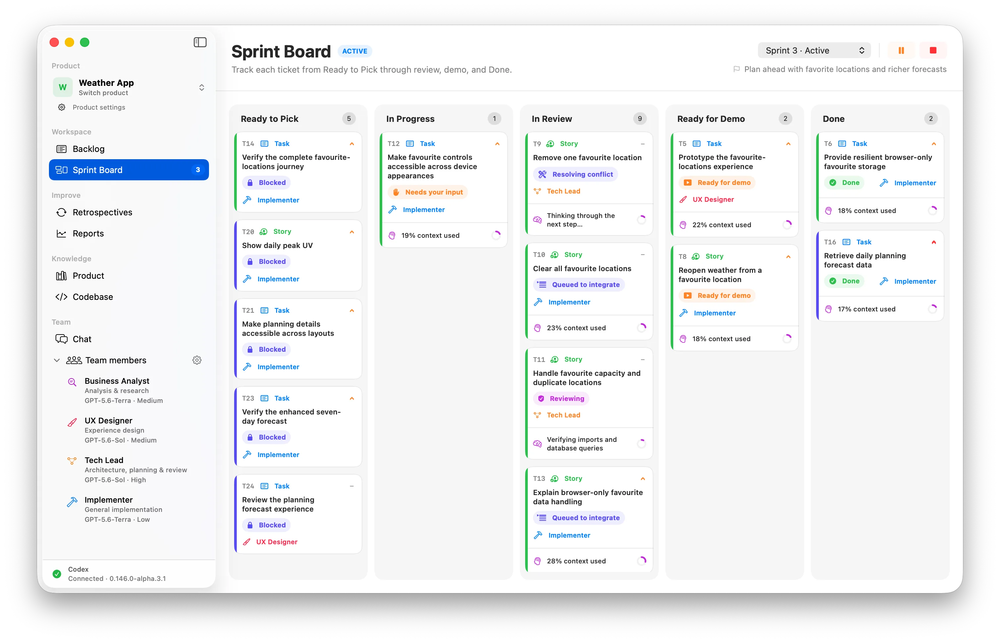

# Spedito

Spedito is a local-first, macOS-native product-delivery app for product
owners working with coding agents. Turn product ideas into a backlog, plan
sprints, and let an AI team implement and review tickets while you stay in
control of scope, permissions, demos, and acceptance.

Learn more at [spedito.io](https://spedito.io/).

> [!NOTE]
> **Early access**
>
> Spedito is under active development, so expect bugs and breaking changes.
> For now, it supports macOS and Codex only. Contributions, bug reports, design
> feedback, and documentation improvements are welcome.



## Install

Download the latest Apple Silicon build as
[Spedito.dmg](https://github.com/cristianrgreco/spedito/releases/latest/download/Spedito.dmg),
open it, and drag **Spedito** into **Applications**.

The app is not yet signed with an Apple Developer ID. On first launch, macOS may
block it: open **System Settings → Privacy & Security**, choose **Open Anyway**,
then confirm. If there is enough demand, we will get a developer certificate and
notarize future releases.

Spedito requires an Apple Silicon Mac running macOS 14 or later, Git, and
a compatible Codex app or `codex` installation.

## What it does

- Organises ideas into epics, tickets, a backlog, and sprints.
- Coordinates specialist AI team members to refine, implement, and independently
  review work while the product owner controls permissions, demos, and
  acceptance.
- Isolates code changes in Git, supports GitHub delivery, and keeps product
  state, work logs, and verified knowledge local.

## Build from source

```sh
git clone https://github.com/cristianrgreco/Spedito.git
cd Spedito
swift test
swift run Spedito
```

GitHub repository workflows require a Spedito GitHub App with Device Flow and
expiring user-to-server tokens enabled. Local builds remain fully usable without
it; GitHub actions show as unavailable. To enable them in a development bundle:

```sh
export SPEDITO_GITHUB_CLIENT_ID="<public client ID>"
export SPEDITO_GITHUB_APP_SLUG="<public app slug>"
./scripts/build_app.sh debug
```

`scripts/relaunch.sh` uses those exports when present. Otherwise, an authenticated
GitHub CLI refreshes the public values from the current repository variables
before the script falls back to the previous development bundle.

The App requests only Metadata read, Contents read/write, Pull requests
read/write, and Workflows write. It does not use a client secret or private key.

See the [product specification](docs/product-spec.md),
[technical design](docs/technical-design.md), and
[release guide](docs/releasing.md) for more detail.

The static product website lives in [`Website`](Website).

## Privacy

Spedito has no cloud backend or analytics service. Product state stays in the
local workspace, but Codex may send the context needed to perform work to
OpenAI under the data controls for your account. Imported-repository analysis
sends files from a sanitized snapshot of the accepted revision while excluding
credential-shaped paths, Git internals, local control data, symlinks, and
non-regular objects. GitHub authorization uses Device Flow, stores expiring
tokens atomically in Apple Keychain, and supplies them to `/usr/bin/git` only
through isolated, short-lived credential-cache sockets. Do not store secrets in
source files or include them in tickets, product knowledge, pull-request text,
screenshots, issues, or bug reports.

## Contributing

Please read [CONTRIBUTING.md](CONTRIBUTING.md), the
[Code of Conduct](CODE_OF_CONDUCT.md), and [SECURITY.md](SECURITY.md) before
participating.
