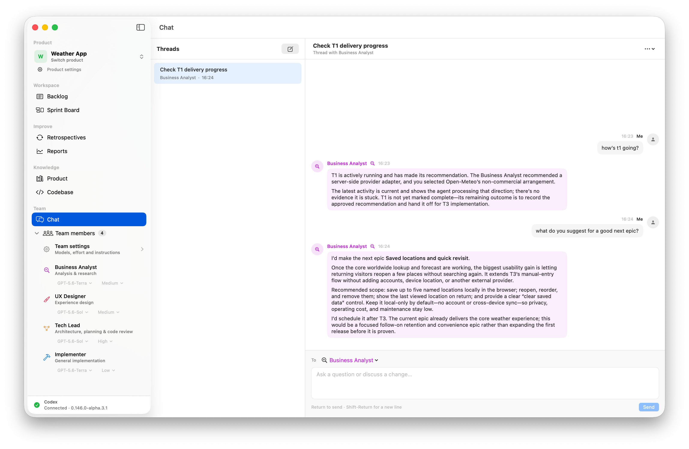

# StoryPointless

StoryPointless is a local-first, macOS-native product-delivery app for Product
Owners working with coding agents. It turns product intent into a Backlog,
coordinates implementation and independent review in isolated Git workspaces,
and keeps the Product Owner in control of scope, permissions, demos, and
acceptance.

> [!WARNING]
> StoryPointless is an early preview. Expect incomplete workflows, compatibility
> problems, breaking changes, and bugs. Back up important repositories and do not
> use it as the sole control plane for production-critical or regulated work.



## Current status

StoryPointless is under active development and is not yet a supported product.
The current build demonstrates a substantial local delivery loop, but it has not
received an independent security audit and its release packaging is not signed
or notarized with an Apple Developer ID.

The app currently supports:

- local product workspaces backed by SQLite and Git;
- Epics, Tickets, Backlog refinement, Sprint planning, and dependency-aware
  delivery;
- a configurable Codex team with Business Analyst, UX Designer, Implementer,
  and Tech Lead roles;
- isolated ticket branches and worktrees, parallel implementation, independent
  review, serialized integration, and Product Owner approval;
- structured questions and scoped permission requests in the Ticket Work log;
- reviewed local demos, candidate feedback, and completion handoffs;
- local Product knowledge, Team conversations, Retrospectives, and Reports; and
- recovery of durable delivery state after a normal quit or interruption.

Important limitations:

- Apple Silicon and macOS 14 or later are the only supported platform and OS
  combination.
- StoryPointless requires a compatible installed Codex app or `codex`
  executable and the corresponding OpenAI account access.
- The current Git implementation relies on a usable local Git installation.
  Fully self-contained Git distribution has not been completed.
- There is no StoryPointless cloud service, multi-user collaboration, automatic
  deployment, update channel, or remote execution.
- GitHub release builds are ad-hoc signed and not notarized. macOS will warn
  before opening them.
- Not every stack, toolchain, or Codex version has been tested.

See the [product specification](docs/product-spec.md) for intended behaviour and
the [technical design](docs/technical-design.md) for the current architecture.
The README is the source of truth for what is available in the early preview.
Maintainer release steps are documented in the
[release guide](docs/releasing.md).

## Cost and licence

StoryPointless is free and open source under the
[Apache License 2.0](LICENSE). It does not currently have a paid service or
cloud component. Your Codex, ChatGPT, API, model, hosting, and other third-party
usage may still incur charges under those providers' terms.

## Installing an early release

Release builds will be published on the
[GitHub Releases page](https://github.com/cristianrgreco/storypointless/releases).
Until the first tagged release exists, build the app from source.

Download the Apple Silicon DMG and its SHA-256 checksum, verify the download,
open the DMG, and drag **StoryPointless** to **Applications**.

Because the project does not yet have an Apple Developer ID, downloaded builds
are not notarized. Review the release notes and checksum, then use Finder's
**Open** context-menu action if you choose to run the build. Do not bypass macOS
security warnings for a file you did not obtain from this repository.

## Building from source

Requirements:

- an Apple Silicon Mac running macOS 14 or later;
- Xcode with a Swift 6.2-compatible toolchain; and
- Git.

Clone and test:

```sh
git clone https://github.com/cristianrgreco/storypointless.git
cd storypointless
env \
  SWIFT_MODULECACHE_PATH="$PWD/.build/module-cache" \
  CLANG_MODULE_CACHE_PATH="$PWD/.build/clang-cache" \
  swift test -Xswiftc -warnings-as-errors
```

Run the Swift package executable:

```sh
swift run StoryPointless
```

Build a local application bundle:

```sh
./scripts/build_app.sh release
```

The application is written to
`.build/app/release/StoryPointless.app` and receives an ad-hoc signature by
default. The build script also accepts these release metadata variables:

- `STORYPOINTLESS_BUNDLE_IDENTIFIER`
- `STORYPOINTLESS_VERSION`
- `STORYPOINTLESS_BUILD_NUMBER`
- `STORYPOINTLESS_SIGN_IDENTITY`

For development relaunches, use:

```sh
./scripts/relaunch.sh
```

That script rebuilds, stops an existing debug StoryPointless process, and runs
the new app in the foreground. Do not use it when preserving an active agent
turn matters; normal app quit uses the recovery path.

## Data and privacy

StoryPointless has no application cloud backend or analytics service. Each
product keeps its control-plane database inside its local workspace at:

```text
<product workspace>/.storypointless/product.sqlite
```

The `.storypointless` directory is excluded from the product's Git history.
Source changes remain in local Git repositories unless the Product Owner
explicitly configures or uses an external remote.

StoryPointless controls the selected Codex installation locally, but Codex may
send prompts, selected product context, and tool results to OpenAI. Review the
Codex and OpenAI data controls that apply to your account before using private
or regulated material. Never put production secrets into Ticket descriptions,
Product knowledge, screenshots, issues, or bug reports.

## Contributing

Contributions are welcome, including bug reports, documentation improvements,
accessibility feedback, design critique, tests, and focused code changes. Please
read [CONTRIBUTING.md](CONTRIBUTING.md) and the
[Code of Conduct](CODE_OF_CONDUCT.md) before participating.

This is an early project with a deliberately opinionated product model. Opening
an issue before undertaking a large change is the best way to confirm scope and
avoid wasted work. Security vulnerabilities should follow
[SECURITY.md](SECURITY.md), not a public issue.

## Licence

Copyright 2026 Cristian Greco.

Licensed under the [Apache License, Version 2.0](LICENSE).
