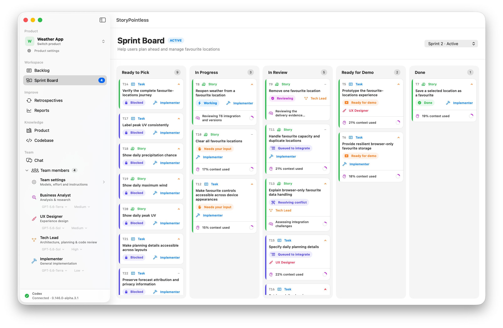

# StoryPointless

StoryPointless is a local-first, macOS-native product-delivery app for Product
Owners working with coding agents. Turn product ideas into a Backlog, plan
Sprints, and let an AI team implement and review Tickets while you stay in
control of scope, permissions, demos, and acceptance.

_Early access: StoryPointless is under active development, so expect bugs and
breaking changes._



## Install

Download the latest Apple Silicon DMG from
[GitHub Releases](https://github.com/cristianrgreco/storypointless/releases),
open it, and drag **StoryPointless** into **Applications**.

The app is not yet signed with an Apple Developer ID. On first launch, macOS may
block it: open **System Settings → Privacy & Security**, choose **Open Anyway**,
then confirm. If there is enough demand, we will get a developer certificate and
notarize future releases.

StoryPointless requires an Apple Silicon Mac running macOS 14 or later, Git, and
a compatible Codex app or `codex` installation.

## What it does

- Organises products into Epics, Tickets, a Backlog, and Sprints.
- Coordinates specialist AI team members for refinement, implementation, and
  independent review.
- Isolates delivery in Git branches and worktrees before Product Owner approval.
- Keeps questions, permission requests, progress, and decisions in each Ticket's
  Work log.
- Runs locally, with product state stored in the product workspace.

## Build from source

```sh
git clone https://github.com/cristianrgreco/storypointless.git
cd storypointless
swift test
swift run StoryPointless
```

See the [product specification](docs/product-spec.md),
[technical design](docs/technical-design.md), and
[release guide](docs/releasing.md) for more detail.

## Privacy

StoryPointless has no cloud backend or analytics service. Product state stays in
the local workspace, but Codex may send the context needed to perform work to
OpenAI under the data controls for your account. Do not include secrets in
Tickets, Product knowledge, screenshots, issues, or bug reports.

## Contributing

Contributions, bug reports, design feedback, and documentation improvements are
welcome. Please read [CONTRIBUTING.md](CONTRIBUTING.md), the
[Code of Conduct](CODE_OF_CONDUCT.md), and [SECURITY.md](SECURITY.md) before
participating.
