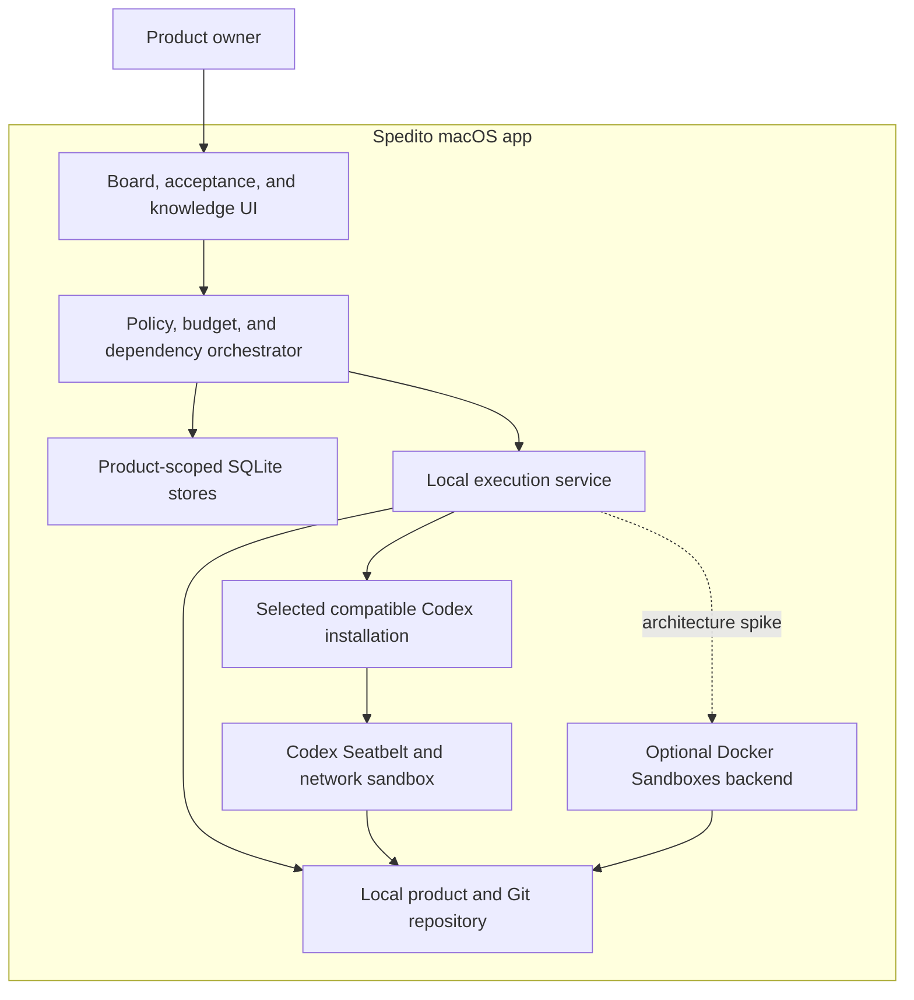

# Spedito: product specification

- **Status:** Public working draft
- **Date:** 15 August 2026
- **Product name:** Spedito
- **Website:** [spedito.io](https://spedito.io/)
- **Audience:** Users, contributors, product, design, and engineering

This document describes the intended product behaviour and durable product
language. It includes implemented and planned behaviour; it is not a promise
that every capability is available in the current build. The
[README](../README.md) is the source of truth for the current early-preview
implementation and its limitations. Proposed work remains subject to product
owner review and may change as the project learns from real use.

## 1. Executive summary

Spedito is a local-first AI product-delivery system for people who have a
product they want to build and want coding agents to operate through a governed,
owner-facing workflow.

The first release line is a macOS application. The product owner describes a
product, connects a compatible Codex installation, and uses Spedito to
manage product records, repositories, agent workspaces, local previews, and
delivery history. It exposes product concepts—not terminals, CLIs, Git commands,
or local runner configuration—as the normal workflow. Early builds may still
require local developer components and are not yet a self-contained production
distribution.

The product gives a human product owner a familiar agile control surface—a
backlog, work items, planning, a live delivery board, acceptance, release, and
retrospectives—while AI agents perform much of the planning, implementation,
review, testing, documentation, and operational work.

The product is not merely an issue tracker with AI assignees. Existing tools can
already delegate an issue to a coding agent. Spedito instead owns the
difficult local layer between an idea and an accepted increment:

- turning product intent into an executable, testable work contract;
- assigning Codex model, reasoning-effort, role, and permission profiles to work;
- scheduling parallel work without creating code conflicts or runaway spend;
- showing evidence of correctness, not just agent-authored status updates;
- forecasting and controlling monetary cost, elapsed time, and human attention;
- preserving decisions and verified knowledge as the product evolves; and
- giving a non-engineer a safe path to preview, accept, release, and roll back.

The public product promise is:

> **Your AI product team, from outcome to verified release.**

The first target should be technically literate solo founders and small product
teams, not every non-technical entrepreneur. They have the urgency and context
to evaluate the system while tolerating an early product's limits. Broader
non-technical use should follow only after the release and governance model is
proven.

## 2. Recommendation at a glance

### Keep

- The agile mental model. Backlogs, readiness, small batches, review,
  acceptance, release, and retrospectives remain useful coordination tools.
- Work items as the place where intent, constraints, discussion, decisions, and
  delivery evidence meet.
- A visible team of agents with capabilities, roles, availability, cost, and a
  performance history.
- A parallel knowledge system that improves the context supplied to later work.
- User-defined quality expectations and human approval for meaningful releases.

### Change

- Do not make story points equal tokens. Show a probabilistic forecast in money,
  elapsed time, and likely human attention. Keep tokens as an underlying cost
  signal.
- Do not start every sprint item at once. Starting a sprint should activate a
  dependency-aware scheduler with work-in-progress, budget, repository, and
  environment constraints.
- Do not treat an agent's comment as proof of progress. Status should be backed
  by observable events and artifacts such as commits, checks, test results,
  previews, screenshots, and deployment records.
- Do not allow agents to be the sole accountable assignee. A human owns the
  outcome; agents are implementers, reviewers, or contributors.
- Do not let generated prose silently become institutional truth. Knowledge
  needs provenance, review state, freshness, and links to the code and decisions
  that support it.

### Defer

- Additional model providers and an agent marketplace.
- Fully autonomous production releases.
- Enterprise Jira/Confluence feature parity.
- Complex custom workflows and reports.
- Native mobile applications.
- Windows and Linux desktop applications.
- Multi-user and cross-device synchronization.
- Remote execution while the owner's Mac is unavailable.
- General-purpose project management outside software products.

## 3. Product thesis

### 3.1 Problem

Coding agents have made software creation dramatically more accessible, but the
user is still acting as an engineering manager, delivery manager, release
engineer, and repository traffic controller. Work is fragmented across chat
sessions, issue trackers, pull requests, terminal windows, CI systems, hosting
platforms, and documents.

A founder can ask an agent to implement a feature, but still struggles to answer:

- Is the requested outcome defined well enough to build?
- What does this depend on, and what can happen in parallel?
- Which agent is most likely to do it well?
- What will the accepted result cost—not merely the first attempt?
- Is the agent actually progressing, stuck, or repeatedly trying the same thing?
- Did the result satisfy the product intent as well as the tests?
- Is it safe to release, and can it be rolled back?
- What was learned, and will the next agent receive that context automatically?

Existing trackers record work. Agent products execute work. Spedito is
intended to connect planning, execution, verification, learning, and release
into one governed loop.

### 3.2 Hypothesis

If a product owner can express outcomes in a guided backlog, delegate them to
specialized Codex profiles, and receive verified previews within explicit effort
and risk limits, then they can ship useful software without assembling a
traditional development team for every discipline.

### 3.3 Product promise

Spedito converts a prioritized product backlog into a stream of
observable, independently checked, releasable product increments while the
human owner retains control of scope, spend, permissions, and release.

### 3.4 Why agile remains relevant

The valuable part of agile is not estimation theatre or moving cards. It is:

- short feedback loops;
- small, valuable increments;
- explicit prioritization;
- frequent inspection of working software;
- adapting plans based on evidence; and
- continuously improving how the team works.

Those properties become more important when execution is cheap and fast. The
ceremonies should be compressed or automated, but the feedback and governance
loops should remain.

## 4. Target customer

### 4.1 Primary early adopter

A solo founder or product-led micro-team that:

- uses macOS and has a Codex-compatible ChatGPT plan or OpenAI API account;
- is comfortable describing user and business outcomes;
- may have used a coding agent but does not want to operate developer tooling;
- has no dedicated delivery team, or a very small one;
- can evaluate a preview even if they cannot inspect every line of code;
- is willing to approve access, effort, and potentially consequential actions;
- is building a web product with conventional infrastructure.

This user is often a product manager, designer, technical founder, consultant,
or experienced operator building a new product.

### 4.2 Later customer

- Non-technical founders using constrained templates and managed hosting.
- Small agencies operating several client products.
- Internal innovation teams that need auditable multi-agent delivery.
- Existing engineering teams that want a governed Codex orchestration layer.

### 4.3 Deliberate exclusions for the first version

- Safety-critical, medical, financial, or regulated production systems.
- Products that cannot be tested or previewed in an isolated environment.
- Large monorepos with many active human teams.
- Legacy systems requiring privileged access to production data.
- Native mobile, embedded, or hardware-dependent delivery.
- Users expecting the system to determine business desirability without their
  involvement.

## 5. Jobs to be done

### Core job

> When I have a product outcome in mind, help me turn it into a safely shipped
> increment without requiring me to coordinate several coding tools or become an
> engineering manager.

### Supporting jobs

- Help me express a buildable requirement without forcing me to write a perfect
  technical specification.
- Tell me what information or decisions are missing before expensive work starts.
- Show me realistic choices between scope, quality, speed, and spend.
- Let me use agent subscriptions or API accounts I already pay for where this is
  technically and contractually supported.
- Keep multiple agents productive without letting them overwrite one another.
- Explain progress and blockers in product language.
- Give me a working preview and a clear acceptance checklist.
- Preserve why the system works as it does so later changes do not regress old
  decisions.
- Show whether the delivery system is becoming cheaper, faster, and more reliable.

## 6. Product boundary

Spedito is an **AI product-delivery system**, not a general-purpose issue
tracker and not a wrapper that merely assigns a ticket to an agent. It owns the
local loop from readiness through implementation, independent review, product
owner acceptance, and durable learning.

The defining capabilities are:

1. **Outcome governance:** every ticket becomes a bounded, testable work
   contract before delivery.
2. **Configured team members:** model, effort, tools, role guidance, and
   permissions are selected deliberately rather than hidden behind one generic
   agent.
3. **Evidence:** review, checks, diffs, demos, and delivery handoffs support
   completion claims.
4. **Safe local execution:** user-owned accounts, isolated workspaces, explicit
   permissions, and human acceptance constrain agent work.
5. **Durable context:** product knowledge and dependency handoffs make later
   work more informed without treating generated prose as automatic truth.

The first releases deliberately exclude general project management, hosted
execution, automatic production deployment, and multi-user collaboration.
Spedito remains interoperable: product repositories and durable records
must not be held captive by a hosted service.

## 7. Product principles

1. **The human owns the outcome.** Agents may act, but responsibility and
   high-impact approval remain human.
2. **Evidence over narration.** Prefer a check, artifact, or observable event to
   an agent saying that something is done.
3. **Progressive autonomy.** Earn broader permissions through successful work;
   do not begin with unrestricted access.
4. **Small batches win.** Limit simultaneous work to reduce conflicts, spend,
   and review overload.
5. **Cost means accepted cost.** Include retries, review, compute, CI, and
   rework—not just the first model call.
6. **Context must be earned.** Supply the smallest relevant, verified context;
   more tokens are not automatically better.
7. **Learning must be inspectable.** Recommendations should cite the delivery
   history that produced them.
8. **The board is a control surface, not a theatre.** Optimize it for decisions
   and intervention, not pleasing animation.
9. **Releases are reversible.** A release action without health checks and a
   rollback path is incomplete.
10. **Interoperability before captivity.** Repositories, documents, work-item
    history, and decisions must be exportable.

## 8. Core domain model

### 8.1 Product space

A workspace containing members, repositories, environments, knowledge,
delivery policies, safety limits, and one or more delivery views.

Each product has a durable identifying color used by its initial tile in the
product library and current-product header. The first active product uses the
app accent color. Later products use the first color not already identifying an
active product in the contrast-spaced sequence: green, indigo, orange, teal,
pink, and blue. Archived products do not reserve their colors. Restoring a
product preserves its color unless that color already identifies an active
product and another palette color remains available; in that case, the restored
product receives the next available color. The sequence cycles only after the
active products exhaust the palette, and assigned colors remain durable across
relaunches.

Switching the selected product changes only what the product owner is viewing.
Active delivery continues in the background for every product without
interrupting, restarting, or requeuing its implementer, integrator, or tech lead.
Product-scoped progress remains in its product. Unresolved **Needs your input**
tickets remain visible across products through the product switcher and product
library, and opening one takes the product owner to its source ticket.

Product settings provide a destructive-looking but non-destructive **Archive
product** action with explicit confirmation. Archiving safely suspends live
delivery, removes the product from active navigation and selection, and
preserves its backlog, work logs, product knowledge, source workspace, and
delivery history. Archived products remain available from the product library
and can be restored and reopened. Product archival does not silently cancel
ticket scope, discard worktrees, or physically delete audit records.
Archived products do not resume repository setup, incoming-change acceptance,
publication, pull-request reconciliation, or branch cleanup in the background.
Their remote history remains readable locally; restoring the product is required
before preserved repository work can continue.

### 8.2 Human owner

The accountable person for a product or work item. The owner approves material
scope changes, secrets and permissions, acceptance, and release according to
policy.

### 8.3 Agent profile

An installed execution capability, not merely a model name. It records:

- Codex model, reasoning effort, role instructions, and tool configuration;
- supported task types and tools;
- role labels such as implementer, reviewer, QA, researcher, or lead;
- repository and environment access;
- account rate information;
- price signals and budget source;
- observed success, rework, and intervention rates;
- supported event and artifact types; and
- whether credentials live locally, in a customer cloud, or in the hosted vault.

Instructions are composed in explicit layers: immutable Spedito safety
and governance; editable product-wide guidance; the profile's versioned default
or owner override; and the frozen ticket contract plus definition of done. Later
layers cannot grant permissions or bypass earlier governance. The exact model,
effort, and composed-instruction version used by a run are retained for audit
and reproducibility.

“Senior” and “junior” should be presentation shortcuts derived from capability
and performance, not hard-coded claims based solely on model price.

### 8.4 Work item

The durable record of a desired outcome. It contains the user-facing problem,
type, priority, ownership, workflow state, dependencies, discussion, and linked
runs. The initial types are deliberately small:

- **Story:** a user-visible product outcome;
- **Task:** supporting delivery, research, documentation, or maintenance work;
  and
- **Bug:** behaviour that should already work but does not.

Type supports scanning, routing, definitions of done, and normalized reporting;
it must not create three unrelated workflows. Bugs should eventually link to
the delivered ticket or version that introduced the regression when known.

An **epic** is a separate planning container, not a fourth ticket type and not
an executable work item. It describes a broader outcome and contains zero or
more tickets. Its progress, forecast, usage, blockers, and quality signals are
derived from those children; it is never directly assigned to an agent or moved
into a sprint. Tickets may belong to at most one epic initially. An open epic's
progress is derived from its accepted, non-archived tickets:

- **Created:** it has no accepted tickets;
- **Planned:** it has tickets, but none has entered delivery;
- **In progress:** at least one ticket has entered delivery or is delivered,
  while at least one remains undelivered; and
- **Ready to complete:** every accepted ticket is **Done**.

Complete ticket delivery does not by itself confirm the broader product outcome.
An epic that is ready to complete presents a prominent **Complete epic** action.
Completing the epic is the product owner's durable confirmation that the outcome
has been achieved. Completed epics are read-only delivery history until explicitly
reopened; tickets and ticket proposals can belong only to an open epic.

The backlog should present epics as compact, collapsible groups with an outcome,
derived progress, and clear **No epic** group. Open epics appear first; completed
epics collapse into one full-width summary row within the same epic table and can
be expanded inline without duplicating the table headers. The disclosure choice is
remembered per product. Each epic receives the next durable color from the
product's contrast-spaced blue, green, indigo, orange, teal, and pink sequence,
cycling only after the palette is exhausted. Its epic row and every associated
ticket row show the same left-edge marker in the backlog, and associated ticket
cards retain that marker on the sprint board. Owners can drag tickets between
groups without affecting workflow state. Small products do not need an epic,
and autosuggestion should avoid generating empty hierarchy for its own sake.
Archiving an epic also archives its unfinished backlog tickets and rejects its
outstanding proposed tickets atomically while preserving their epic association
for history. Any in-flight proposal generation is cancelled so late results
cannot return to the active backlog. Delivered tickets remain delivered, and an
epic with tickets in active delivery cannot be archived until that work is
finished or removed from delivery.

### 8.5 Work contract

The executable version of a work item. A ready contract contains:

- desired user or operational outcome;
- acceptance criteria with observable examples;
- non-goals;
- constraints and applicable product decisions;
- repository and likely scope;
- dependencies and conflict hints;
- definition-of-done policy;
- security and permission tier;
- system-derived forecast and execution safety envelope;
- human owner and agent roles;
- required deliverables, such as code, tests, preview, migration, or docs; and
- escalation questions that must be answered before execution.

The contract is versioned and immutable for an active run. Material changes
create a new version so the system can explain what an agent was asked to do.

### 8.6 Agent run

One bounded attempt by one agent against one contract version. It owns its
execution environment, event stream, costs, artifacts, outcome, and termination
reason. Retries are new runs, not erased history.

### 8.7 Evidence

A typed artifact used to support a claim. Examples include a commit, diff,
test report, code-coverage report, security scan, screenshot, video, preview
URL, accessibility report, benchmark, migration result, deployment record, or
human acceptance note.

### 8.8 Decision

A versioned record of a meaningful product or technical choice: context,
options, selection, consequences, owner, date, and supporting work items.

### 8.9 Knowledge claim

A retrievable statement with provenance, scope, confidence, freshness, and
links to supporting code, evidence, decisions, or external sources. A claim may
be proposed, verified, disputed, or stale.

### 8.10 Delivery policy

A reusable definition of ready, definition of done, action permissions, quality
gates, review independence, budget thresholds, release approvals, and rollback
requirements.

### 8.11 Ticket knowledge change set

The documentation and durable knowledge produced by one work item. It is linked
to the contract, runs, immutable delivery candidate, review, and acceptance, and
contains:

- a plain-language delivery note explaining the outcome and how dependants may use it;
- version-controlled product, technical, or operational documentation diffs when
  the ticket changes the repository;
- material product or architecture decisions, including rejected alternatives
  and tradeoffs;
- proposed new or updated knowledge claims;
- claims made potentially stale by the change;
- known limitations and follow-up questions; and
- sources and evidence supporting each substantive statement.

The change set is versioned with the candidate. A repository-changing candidate
binds it to an immutable commit; a repository-free research candidate stores the
completion handoff and proposed product knowledge in SQLite without inventing a
file or commit. Agent comments and raw traces can support it, but they do not
automatically become durable product knowledge.

### 8.12 Sprint

The owner-facing unit that authorizes coordinated delivery. A sprint records its
goal, selected contract versions, dependencies, assignments, forecast, planned
acceptance capacity, state, and actual outcome.

**Start sprint** freezes the initial plan and enables scheduler admission. It can
create many internal agent runs, but “run” remains execution terminology rather
than a primary PO action. Plan changes after start are versioned and explained;
they do not rewrite what the owner originally authorized.

### 8.13 Conversation and action proposal

A conversation room is a durable inbox with human and profile participants,
unread state, and an explicit context scope. Its kind is direct message,
product, sprint, ticket, or named group. Messages may cite work items,
decisions, knowledge, evidence, and exact repository revisions, but messages
are not authoritative product records by themselves.

Each top-level owner message starts an independent **conversation thread**.
Replies remain nested beneath it, and the thread has a visible state such as
working, needs input, proposal ready, complete, failed, or cancelled. The owner
can therefore start several questions or requests without waiting for a
previous agent response or worrying about one request corrupting another's
context. Follow-ups inside one conversation thread retain that thread's context
and are processed in order; separate conversation threads may run concurrently
subject to the normal scheduler and shared-usage constraints.

For a product room, a new top-level thread receives at most the previous 100
room messages as conversational history. A reply resumes only its own agent
thread; if that underlying thread must be recovered, Spedito rebuilds it
from the parent message and replies in that product conversation thread, not
from unrelated room traffic. Durable product facts are discovered from the
live product database and repository rather than copied into either history.
A new top-level thread launches a lightweight title request from the first
owner message independently of the substantive response. Its subject updates
as soon as that request succeeds; failure leaves the provisional
question-derived subject and does not fail or delay the readable Markdown
response, which uses short paragraphs, whitespace, and lists where useful. The
room renders the same owner/agent chat bubbles as ticket and epic conversations.
While a turn is active, a bottom status strip streams
concise supported activity summaries—never raw chain-of-thought—and keeps the
stop action nearby. Thread rows show a fixed last-update time rather than a
continuously ticking relative timer.

The room composer creates a new top-level thread by default; replying from an
open thread keeps the message there. The owner may start other top-level threads
while one agent is working; a follow-up in the active thread waits until that
response finishes so it cannot be unpredictably injected mid-turn. An explicit
**Stop** control is available when the owner genuinely wants to cancel the
current response.

A conversation thread is a product-level UI record, not necessarily one Codex
thread. A direct conversation may resume one bounded Codex thread for follow-up
turns. A group conversation may coordinate separate Codex threads for the
mentioned profiles and optionally ask the lead profile to synthesize their
responses. The UI keeps this implementation detail hidden while preserving the
underlying run and provenance links for audit and recovery.

An action proposal is a typed, versioned command produced from a conversation or
refinement session. It records the source message, proposer, target record and
version, before/after business diff, rationale, affected fields, validation
result, and state: proposed, partially accepted, accepted, rejected, stale, or
applied. Applying it requires owner authorization and writes the normal domain
transaction and audit event. A proposal becomes stale rather than overwriting a
ticket that changed after the proposal was created.

Concurrent conversation threads may read the same ticket version, but they
cannot silently overwrite one another. Every proposal carries its base ticket
version. Applying the first accepted proposal increments that version; other
open proposals against the old version become **stale** and must be refreshed,
rebased as a new business-readable diff, or rejected. Threads can continue
discussing after this happens, but stale actions are never auto-applied.

## 9. End-to-end experience

### 9.1 Onboarding

1. The owner names a product space or chooses a public or private repository
   from the repositories available to an already-authorized GitHub account.
   Pasting a canonical public HTTPS link from GitHub, GitLab, Bitbucket, or
   Codeberg remains available when no suitable repository is listed.
   The first concrete outcome belongs in an epic, while durable cross-epic
   context such as target users, constraints, and principles belongs in product
   knowledge.
2. Spedito creates a local product directory and Git repository. It may
   begin with an empty, agent-planned product, an approved starter template, or
   a managed clone whose existing history and default branch become the
   product's accepted starting point.

For repository-based creation, the owner can authorize GitHub directly in the
new Product flow, then select a public or private repository available to the
Spedito GitHub App. Supplying a canonical public HTTPS link from GitHub, GitLab,
Bitbucket, or Codeberg without embedded credentials, query parameters, a
fragment, or a non-default port remains available. Authorized GitHub access
uses an expiring user token only through an isolated, short-lived Git credential
session; the token is never placed in the clone URL or repository configuration.

When an existing GitHub App installation exposes only selected repositories, the
owner can open that installation's repository-access settings from the new
Product flow. Spedito refreshes the available repositories automatically when
the owner returns, while retaining a manual refresh action for propagation
delays.

If the selected GitHub repository has no commits, Spedito creates a blank local
Product, links it to that exact repository, and initializes its default branch.
If the repository already has history, Spedito imports it instead.

The imported Product remains connected to that exact authorized repository.
Spedito clones the full history and preserved `origin` into the normal
product workspace, maps the
source default branch's exact accepted commit to local `trunk`, and activates
the product only after its product-scoped database and repository provenance
are durable. The product opens immediately after local activation; repository
understanding does not block onboarding.
While background setup is active, the product switcher shows an importing
status. Hovering it reveals the current setup phase and a concise live activity
summary; raw model reasoning is never exposed. The transient status disappears
when setup completes, while failures remain actionable from the sidebar.

Spedito then analyzes a sanitized, read-only snapshot of that exact revision in
the background. The snapshot excludes Git internals, the Spedito control plane,
credential-shaped paths, symlinks, submodules, and non-regular repository
objects. A business analyst proposes bounded, evidence-backed product knowledge
and a separate tech lead independently approves or rejects every proposal.
Only approved pages become versioned, automatically verified product knowledge.
Interrupted work is recovered as a new versioned attempt; a changed accepted
revision makes the old attempt stale.
A completed analysis with no approved product knowledge is a valid terminal
outcome. Spedito explains that result without starting another Codex turn on
later launches. The owner may explicitly start one new versioned analysis
attempt when another pass is useful.

SQLite in `.spedito` remains the only authoritative and maintained copy of
product knowledge. Repository analysis and accepted ticket knowledge changes
update that local control plane without creating, changing, or committing
repository files. Existing repository documents remain ordinary source evidence,
not automatically managed product knowledge.

Repository connection is an explicit owner workflow. Repository status checks
run automatically during setup, recovery, and ticket integration. An imported
Product can connect only to the GitHub repository
preserved in its import provenance. A locally created Product can connect to an
accessible empty public or private repository; Spedito proves that it is empty
and pushes only a minimal bootstrap root to establish the default branch. If the
Product already contains accepted local source history, the owner sees the
exact captured revision and size before connecting. Spedito publishes that
history through one dedicated non-draft pull request, merges only the
unchanged head, deletes its merged publication branch, and mechanically
reconciles the result before normal ticket delivery begins. Every later
reviewed ticket remains a separate pull request whose publication branch is
also deleted after its unchanged head is merged.

Connecting a Product is one guided flow. The first Product uses GitHub Device
Flow authorization; later Products reuse the sole authorized account when
unambiguous. GitHub also requires explicit GitHub App repository access.
Spedito opens the installation settings to add repositories or accept updated
permissions and refreshes access when the owner returns. The owner never selects
a second repository for an imported Product.

A verified repository check compares the accepted local `trunk` with two
observations of the repository identity and default-branch head around an
isolated Git fetch. Spedito runs that check automatically when setup, recovery,
or ticket integration requires it instead of asking the product owner to refresh
routine status. Routine repository diagnostics do not appear as a separate
Codebase status or action; the sprint journey surfaces only results that need
the product owner's attention.
A fast-forward remote change may be accepted directly only after Spedito validates the exact incoming
tree and the owner reviews and confirms it. A merged Spedito pull request may
align rewritten GitHub history only when Git proves that the published commit,
resulting tree, and current local base match.

Starting a sprint does not wait for or block on GitHub. When a reviewed ticket
enters integration, Spedito performs a fresh verified repository check and
combines the candidate with both the latest accepted local `trunk` and the exact
observed GitHub default-branch head. A clean merge continues automatically. A
file conflict uses the ticket's existing Integrator run, preserved worktree,
work log, comments, and **Needs your input** state. The Integrator resolves
mechanical or semantically unambiguous overlap; a material product choice
becomes a concise ticket question for the product owner. Any result that
incorporates GitHub changes receives focused tech lead review before demo.
Independent tickets may continue while the affected ticket and its dependants
wait.

Manual incoming-history acceptance remains unavailable while a sprint is
active because accepted `trunk` must not change underneath delivery. Ticket
integration does not mutate accepted `trunk`; it carries the verified remote
head in the exact reviewed candidate until product owner approval. Unrelated
history, changed repository identity, unsupported Git filters, path collisions,
submodules, Git LFS pointers, and other states that cannot safely become ticket
work stop with an owner-facing explanation. Spedito never force-pushes or
rewrites the remote default branch.

The sprint board keeps the connected repository's delivery state alongside the
work. Routine incoming changes are handled within the affected ticket rather
than presented as a manual Git review task. Product settings remains the place
for connection setup and exceptional repository intervention; it does not
prompt the owner to refresh routine repository status. Ordinary unpublished
local work does not turn Product settings into a warning.

For a connected Product, every reviewed repository-changing ticket revision is
published automatically as a draft pull request from its exact integrated commit.
Spedito prefills the title from the ticket key and title and the description from the
ticket context and acceptance criteria; the reviewed revision is not repeated in
the description because GitHub already shows the pull request's commit. Pull-request
creation is recorded as an inline ticket work-log entry with its GitHub link;
the sprint board and ticket header do not expose pull-request numbers, status
banners, or manual review-refresh controls. Pull-request reviews and inline
review comments appear in that ticket's work log with the GitHub reviewer's
identity, source link, repository path, line or range, reviewed commit, and
bounded diff hunk so both the product owner and the resumed delivery agent can
act without GitHub access. Spedito checks all active pull requests for the
selected Product in one serialized adaptive cycle rather than starting one
timer per ticket. A visible ticket and tickets awaiting Product Owner action are
checked first and more frequently; polling slows when neither needs attention
and while Spedito is not the active app. Product owner actions still perform an
immediate authoritative check. Requested changes return the ticket to In
Progress so the delivery team can revise the same pull-request branch; once the
integrated result passes its single tech lead review and demo gates, Spedito
marks the pull request ready for review.

A completed business analyst research or investigation ticket may instead have
no repository changes. Spedito persists its completion handoff, reported checks,
review instructions, and proposed product knowledge as an immutable local
outcome, sends that exact outcome through tech lead review, and presents it for
product owner acceptance. The review card names the concise outcome, exposes
the full analysis and evidence on demand, and separates the decision and checks
the product owner should consider. It creates no empty commit, publication
branch, draft pull request, or managed demo. The Codebase view remains unchanged.

For a repository-changing ticket, product owner approval merges the exact reviewed
head through GitHub, reconciles the merged history locally, and then completes the
ticket. Approval of a repository-free outcome publishes its accepted knowledge and
completion handoff without contacting GitHub or moving local `trunk`. If the
GitHub default branch moved after demo preparation, Spedito returns the pull
request to draft and sends the same candidate through ticket integration and
focused review again. A moved publication branch, changed pull-request head,
closed pull request, or unsafe repository state still fails closed. External
approval never completes a ticket. Each ticket has at most one active pull
request; parallel tickets may have separate pull requests, while approval and
local reconciliation remain serialized.

Choosing **Approve and complete** acknowledges the product owner's decision
immediately and closes the ticket detail so the owner can continue elsewhere.
The board shows **Completing ticket** while Spedito performs the applicable
authoritative GitHub check, merge and local reconciliation, publishes accepted
knowledge, and completes the workflow in a retained background task. A
repository-free outcome skips every Git and GitHub step. The ticket becomes
**Done** only after its required operations succeed. A failure leaves the
reviewed result available for retry, records the failure in the ticket work log,
and presents the recoverable error; Spedito never optimistically claims that an
unmerged revision or unpersisted outcome is complete.

3. Spedito discovers the signed-in official Codex app. The owner can
   confirm it or explicitly add and select another Codex installation.
4. Spedito creates an opinionated starter team: business analyst, UX
   designer, lead/reviewer, and general implementer. The owner can add optional
   specialist team members such as frontend, backend, security, accessibility, or
   marketing when the product actually needs them. Profiles use Codex models,
   reasoning effort, role instructions, and permission policies.
5. The business analyst assesses delivery-environment readiness from bounded
   accepted-ticket contracts and verified product knowledge, especially
   **Environments**. Planning does not inspect repository source or Git history. If the product has
   no sufficient way to build, test, prototype, demo, and locally run its likely
   work, the owner is asked only for a material technology or hosting constraint
   in business terms; the team recommends the simplest suitable option when the
   owner has no preference.
6. Spedito proposes the starter delivery policy and any required
   environment-foundation work. Executable product tickets are blocked by that
   foundation, while authorised research and genuinely environment-neutral
   design can proceed in parallel. The foundation verifies the repository,
   sandbox, stable build/test/run/demo entry points, permission behaviour,
   event reporting, and credential boundaries before dependent work begins.

The onboarding must make data and credential boundaries explicit. “Connected”
should show exactly what can be read, changed, deployed, and billed.

### 9.2 Backlog creation

The owner can type an idea in ordinary product language. AI assistance can:

- rewrite it as an outcome rather than an implementation instruction;
- suggest acceptance examples and edge cases;
- identify missing product decisions;
- retrieve related decisions and prior work;
- detect duplicates and contradictions;
- propose dependencies, splits, and non-goals; and
- warn when a request is too broad or not safely testable.

When the owner creates an epic, Spedito initially persists only that submitted
outcome. It does not derive a title by shortening the outcome or invent success
criteria, constraints, or tickets. Those fields remain absent until the business
analyst completes analysis and returns the reviewable epic metadata and ticket
plan. While analysis is pending, backlog and relationship labels may use the
submitted outcome as a display fallback without storing it as the epic title.
After analysis, the product owner may edit the title, goal, success criteria, or
constraints before accepting any proposed tickets. Once edited, those fields
are authoritative: a failed or interrupted planning retry receives them as
owner-reviewed input and cannot replace them with newly generated wording.

For a new product, one business-analyst profile can also propose a starter
backlog rather than waiting for the owner to invent every ticket. This is one
coherent analysis, not one ticket authored by each team member. Each proposal
includes its rationale, draft acceptance criteria, uncertainty, likely future
owner, Story/Task/Bug classification, forecast range, and explicit dependency edges. The proposal view should
make useful parallelism visible: for example, a weather-provider investigation
may block the real data adapter while a UI can proceed against an agreed mock
contract.

Scope determines proposal count, not team size. The initial structured turn can
return 1–24 tickets and should normally use as many as the product genuinely
needs. Business analyst, UX designer, and implementer roles may repeat freely;
the role is a routing recommendation for later delivery. The decoder rejects
unknown dependency references, self-dependencies, and dependency cycles.

Every starter-backlog and epic plan also returns a structured environment
assessment: **sufficient**, **foundation required**, or **not required**. Each
proposed ticket declares whether it is independent of, establishes, or requires
the product environment. When a foundation is required, the plan names exactly
one proposed implementer task or accepted active ticket as that foundation, and
every ticket that needs an executable environment must depend on it directly or
transitively. Spedito rejects a generated plan that omits or contradicts
that dependency path.

The assessment uses bounded accepted-ticket contracts plus relevant verified
product knowledge, including **Environments**. Spedito supplies this
evidence in the planning prompt; the business analyst does not inspect
repository source, manifests, scripts, CI, documentation, or Git history during
planning. An incidental runtime installed on the product owner's Mac is not
evidence of a supported product environment. A
non-technical owner is not asked to choose Node versus Python, package-manager
paths, caches, or sandbox permissions by default. Clarification instead asks
about material outcomes such as portability, hosting, privacy, cost, and
maintenance, presents a recommendation, and exposes technical stack choices
only when the owner has expressed a relevant preference. Every clarification
choice is a complete answer rather than a promise to provide information later;
an unlisted existing constraint is entered through the question's **Other**
field. Choosing a standard recommendation explicitly uses evidence already
available without creating research work, while choosing time-boxed research
creates a separate business analyst ticket before the environment foundation.
Because each question permits exactly one selection, every option describes the
complete resulting scope; options never compound earlier choices with labels
such as “as well,” “too,” or “also.”

All owner-facing business analyst responses use familiar words, short sentences,
and one idea per sentence. They lead with what the owner needs to know, decide,
or do. Internal evidence labels, planning mechanics, and technical environment
terms are translated into their practical effect and omitted when they do not
affect an owner decision. Readiness confirmations are brief: they say whether
planning can continue and mention only research or setup work that the plan will
need.

The environment-foundation ticket is a concrete delivery outcome, not a vague
investigation. Its acceptance criteria establish the approved toolchain and
supported versions; repository-owned build, test, local-run, and demo entry
points; run-private temporary and cache locations; required filesystem,
localhost, network, and service capabilities; a successful managed readiness
check; known limitations; and a verified **Environments** product knowledge
update. When current external evidence is genuinely needed to recommend a
stack, hosting model, licence, cost, or maintenance approach, the Business
Analyst proposes a separate research ticket only with product owner
authorisation, and the foundation depends on it. Deployment constraints are
considered early, but production accounts, credentials, signing identities, and
release authority remain separately approved work.

Epic planning must cover the complete path to the agreed outcome without
forcing every outcome through the same delivery stages. When the owner has
authorised research, its recommendation can be a prerequisite for downstream
work, but it must not replace delivery when the epic success criteria require a
product change. Ticket boundaries follow independently valuable outcomes,
genuine dependencies, and useful parallelism rather than a default research,
design, implementation, and verification sequence. Verification is explicit in
the relevant acceptance criteria and becomes a separate ticket only when its
outcome should be delivered, reviewed, or scheduled independently. The epic
details view keeps proposed tickets in its **Tickets** section and exposes
**Accept all** and **Dismiss all** in that section's header; row selection is a
convenience, not the only discoverable way to continue. In the backlog, the
same actions sit in a full-width proposed-ticket group row between the shared
table headings and the proposed rows, so normal ticket columns remain aligned
and the scope of "all" stays explicit.

When a ticket belongs to an epic, both its editable details and delivery Work
log show that relationship as a compact link to the epic details. The link
remains available from completed delivery history and preserves any unsaved
ticket edits while the owner inspects the epic. Completed and archived epic details
are read-only.

Agreeing constraints for an unnamed real external source does not select that
source when current evidence about candidates, terms, suitability or operation
is still required. Clarification choices distinguish a separate Business
Analyst comparison and recommendation from an already approved owner-supplied
choice and from explicitly delegating selection to the implementer during
delivery without a separate recommendation. Vague choices such as “let the team
choose” are not used. Authorising the business analyst or team to identify,
compare, recommend or choose using current external evidence authorises a
decision-enabling research ticket. When every credible recommendation still
requires the agreed product change, the initial epic plan also includes the
downstream delivery tickets rather than waiting for research to rediscover them.

Epic clarification is durable across application restarts. If its underlying
Codex thread has expired, Spedito starts a replacement read-only thread,
supplies the preserved business analyst conversation and product owner answers,
and continues without asking the owner to re-enter or discard resolved input.
Epic details also keeps the ordinary team composer available before, during, and
after clarification. The product owner may address any one team member without
submitting or dismissing the business analyst's structured questions. Each
question retains its own choices and inline **Other** text field; only the
separate **Submit answers** action records those governed answers and advances
epic refinement. Ordinary chat remains durable context but is not treated as an
authoritative refinement answer or permission to change epic scope. Active
question cards remain anchored to the business analyst message that introduced
them, and any later ordinary chat appears below them in chronological order.

Role-aware suggestions should produce a coherent delivery graph rather than a
list of generic engineering tasks. For a weather product, an illustrative
proposal is:

- **Business analyst:** investigate and recommend a suitable weather-data
  provider;
- **Implementer:** when verified **Environments** guidance is insufficient,
  establish and document the reusable delivery environment, depending on any
  authorised technical recommendation;
- **UX designer:** design and validate the location-search and forecast
  prototype, proceeding independently when its review artefact does not require
  the missing runtime;
- **Implementer:** build the approved experience, depending on the UX contract
  and provider interface while remaining able to start against mocks, and also
  depending on the environment foundation when one is required; and
- **Implementer:** add a service only if caching, credential protection,
  aggregation, or another backend responsibility is justified. This may be a
  separate parallel ticket, but it does not require a permanent backend team member.

The **Lead** reviews the resulting delivery against the approved ticket
contract. Higher-risk work can add a separate Security Auditor or specialist
review team member without changing the starter team.

The team members influence analysis, deliverables, and dependency reasoning; they
must not cause the system to invent a backend or serialize independent work.

An empty or newly created backlog prominently offers **Autosuggest tickets**.
The same action remains available later as a way to find missing work. Clicking
it creates one durable suggestion session for the current product; repeated
clicks cannot start another analysis while proposals still await review. Once
the owner has accepted or rejected every proposal, the action becomes **Suggest
Missing tickets** and supplies accepted scope plus the latest rejected proposals
to the next gap analysis.

Conditional implementation is not treated as committed scope. If a research or
product decision may determine that no implementation is required, autosuggest
creates the decision ticket first. A business analyst delivering that authorised
research normally supplies its decision, contract, evidence and caveats to the
already planned dependant tickets through its completion work log and verified
product knowledge. It returns no follow-up proposals when active tickets already
cover the downstream work, and it never rewords, splits or replaces those tickets
merely because research added detail. If evidence materially conflicts with an
accepted ticket contract, the business analyst asks the product owner rather than
silently changing scope.

Research may recommend zero or more fully formed follow-up tickets only when its
evidence establishes genuinely new work absent from every active ticket. The Tech
Lead reviews those exceptional recommendations with the research artefact, the
product owner sees them before approving the outcome, and approval publishes them
as a labelled, reviewable suggestion batch in the backlog. Each accepted follow-up
inherits the research ticket's epic and retains the completed research ticket as a
durable prerequisite; rejected recommendations never become scope. Multiple
outstanding suggestion batches remain queued for review rather than hiding one
another.

While the business analyst works, the backlog view shows one temporary
analysis card with phases such as **Understanding the product outcome**,
**Mapping research, design, and delivery work**, and **Finding dependencies and
parallel paths**. It does not render teammate-shaped cards that imply several
agents are independently generating tickets. These placeholders
are visually distinct from work items, do not count toward backlog totals or
sprint scope, and can be cancelled or recovered after restart. On launch,
Spedito automatically retries an interrupted epic suggestion session once,
first recovering any completed structured result from the saved conversation and
then continuing from the durable refinement transcript when another turn is
needed. The animated ticket placeholders remain visible in the backlog and epic
ticket list throughout recovery. A genuine repeated generation or validation
failure remains reviewable and does not loop automatically on every launch. As
results arrive, placeholders become vertically stacked ticket proposals inside
a dashed
suggested-work region above the ranked backlog. Dependency depth creates a compact
staggered connector outline, while each card retains explicit dependency labels,
rationale, acceptance criteria, and **Accept**, **Reject**, **Discuss**, and
batch-review actions. Acceptance removes the proposal card and creates the
normal backlog ticket; rejection never creates scope.

Suggested tickets are not backlog records until the owner accepts them. Temporary
references such as `S1` are shown separately and are never part of the ticket title. The
owner can accept, edit, or reject each suggestion, inspect why one item blocks
another, accept the remaining reviewed batch directly, or dismiss the remaining
batch with confirmation. Bulk acceptance only creates backlog records; it never
scopes or starts a sprint.
Accepting a suggestion with still-proposed prerequisites first names the full
transitive prerequisite set, then accepts the selected suggestion and those
prerequisites atomically with their dependency relationships.
Rejecting a prerequisite with dependents first previews the full transitive
impact. Confirmation rejects every remaining dependent proposal and archives any
dependent ticket already accepted into the backlog as one atomic action; tickets
that have entered delivery prevent the cascade and require an explicit recovery
decision. Rejections and edits become refinement feedback; they must not quietly
reappear as committed scope.
Editing a proposed ticket persists its title, type, description, acceptance
criteria, suggested owner, priority, and rationale while preserving its
proposal identity and dependency edges. The edited version survives relaunch
and is the exact version converted into a Backlog ticket if accepted.

After no proposals remain to review, the suggested-work region disappears; its
decisions remain in the audit and future-analysis context rather than occupying
permanent backlog space.

Governed initial epic and ticket refinement share one contract: the Business
Analyst asks consequential questions first, then the application applies the
completed metadata or ticket snapshot as one versioned refinement result. A
ticket refinement preserves existing blockers and adds any newly recommended
prerequisites in that same update. It also resolves the recommended delivery
role to an active team member when the ticket is unassigned, including its saved
Next sprint plan, while preserving an existing product owner assignment. For
executable work it consults verified
**Environments** knowledge: an existing foundation is proposed as a dependency,
while a missing foundation is surfaced as a separate split recommendation
rather than hidden inside the feature ticket. It fails rather than overwriting
a newer saved ticket version. Proposed delivery tickets, ordinary team-chat
edits, and later planning suggestions remain reviewable changes; the owner
approves them before they alter scope.

### 9.3 Backlog refinement

Backlog and refinement have their own workspace rather than sharing the active
sprint board. Its primary information is product scope and planning confidence:

- the full workspace is a vertically scrolling, compact ranked list rather than
  a Kanban board;
- **Next sprint** and **Backlog** are the two visible planning sections; dragging
  between them changes sprint intent but never starts execution. A
  cross-section move preserves the ticket's authoritative backlog rank when the
  chosen destination does not express a different relative position;
- the vertical boundary between **Epics** and **Backlog** and **Next sprint** is
  draggable within usable minimum widths. Spedito remembers the chosen
  proportion as a local display preference, and double-clicking the divider
  restores the default balance;
- rows have explicit multi-selection and section-wide select-all. Each section
  has a visible move button that acts on its selected tickets, or every ticket
  in that section when none are selected there. These buttons and dragging any
  selected row move the target set in one persisted operation; selecting a
  complete dependency branch succeeds, while an invalid partial move explains
  which prerequisite or dependent must also be selected;
- ticket creation belongs to the backlog section, and sprint-planning actions
  belong to the backlog header rather than a global title-bar toolbar;
- every row opens a focused ticket surface with editable core and custom fields,
  dependency context, and a durable ticket-level team thread;
- Ticket and epic detail surfaces share the same laptop-safe adaptive sheet
  geometry. Initial business analyst refinement begins automatically when an
  incomplete open item is shown and the team connection is available; the
  header does not repeat that lifecycle as a manual AI action, while a failed
  refinement retains its contextual retry action. Ticket fields remain
  unavailable for editing while the completed refinement is being applied, so
  an in-flight result cannot replace a newer product owner draft;
- top/bottom rank shortcuts and row reordering preserve dependency order. While
  dragging, every dependency-safe insertion position is indicated in blue; an
  invalid hovered position turns red and names the sprint-scope or ranking
  constraint before the owner drops the tickets. Invalid destination rows are
  de-emphasized while valid targets remain at full opacity. Insertion lines and
  constraint labels overlay fixed row boundaries so beginning or moving a drag
  never reflows the table. Colour is reinforced by a warning symbol, text, and
  an accessibility label;
- backlog rank is the authoritative delivery order, while priority remains a
  lightweight urgency/value signal rather than silently re-sorting owner intent;
- dependencies remain explicit graph relationships in the canonical flat list.
  Tree indentation is not authoritative because one ticket may have multiple
  blockers; a future grouped dependency-path lens may summarize simple branches
  without duplicating or hiding work;
- every backlog row shows its persisted provisional delivery assignee, or
  **Unassigned**. Moving work into Next sprint records scope intent only; it must
  not silently choose the first eligible member. Unsaved sprint planning changes
  never leak into this projection, and Start sprint refuses unassigned work;
- row separators span the content width so the compact list reads as one aligned
  table rather than unrelated indented fragments;
- editable values use explicit left-aligned labels and visible input surfaces;
  and
- Codex connectivity is a compact workspace status signal, not an AI teammate.

- total backlog and next-sprint scope;
- value and priority;
- computed readiness, open questions, and stale assumptions;
- dependency and likely-conflict edges;
- system-generated cost, elapsed-time, and human-attention forecast ranges;
- which work is in the next sprint.

Next-sprint membership expresses intent rather than commitment. It does not
authorize execution or silently satisfy dependencies. A ticket can be scoped
before every detail is ready; the readiness summary and sprint planner expose
what must still be resolved before **Start sprint** becomes available.

**Start backlog grooming** opens a structured review rather than an unbounded
group chat.
The business-analyst profile first works with the owner on value, priority,
ambiguity, and acceptance intent. Specialist agents then inspect selected items,
and the lead profile synthesizes:

- readiness failures;
- ambiguity and questions for the owner;
- dependency and likely code-conflict graph;
- opportunities to split by independently valuable outcome;
- possible shared foundations;
- risk tiers;
- suggested implementation and review capabilities; and
- a forecast range with its major uncertainty drivers.

The owner sees proposed diffs and decisions, not a long transcript. They can
accept suggestions individually or as a reviewed batch.

### 9.4 Sprint planning

Once grooming has produced a candidate scope, the owner selects **Start sprint
planning**. This is a guided review, distinct from **Start sprint**. It moves
ticket by ticket through a focused planning room:

- the complete ticket and its acceptance examples are the primary content;
- dependencies, readiness, forecast, delivery assignment, and required evidence are
  visible without opening engineering tools;
- a side conversation addresses one explicitly selected team member at a time
  and shows concise, named replies on the ticket timeline;
- questions are resolved interactively with the owner;
- agent-recommended edits appear as a business-readable proposal that the owner
  can accept wholly, accept in part, edit, or reject; and
- the ticket fields remain directly editable beside the conversation. Every agent
  request records the exact owner-visible ticket snapshot it received; if the owner
  edits that draft or the saved ticket version changes before acceptance, automatic
  apply is disabled and the proposal must be reconciled or regenerated rather than
  overwriting newer work;
- every ticket already placed in **Next sprint** is in scope; the owner returns
  unwanted work to the backlog before planning rather than excluding it a second
  time inside the planner; and
- the owner explicitly chooses a delivery assignee. Ordinary Lead review is
  scheduled automatically against each immutable candidate rather than configured with a
  redundant reviewer picker during MVP planning.

After the last ticket, the owner reviews dependency order, the system-generated
forecast range, remaining shared usage, and acceptance load. Sprint planning does
not wait for AI to write a goal. Saving the plan opens its draft sprint board
immediately, where AI lazily writes and saves one concise outcome from the titles
in the saved sprint scope. The board shows a quiet loading placeholder followed
by the generated value; the goal is not another field for the owner to complete
or approve. Starting the sprint does not wait for generation. If generation
finishes after start, the result fills the still-empty goal for that exact plan
version. An existing non-empty goal is never replaced, and a result generated
from an older plan version cannot overwrite newer scope. Goal generation stops
after 15 seconds if it has not completed, leaving the goal unavailable without
blocking planning or sprint delivery.

The owner does not guess token counts or set per-ticket token budgets. The planner
proposes a sprint that:

- maximizes user value within the cost and risk envelope;
- respects dependencies and repository conflict zones;
- reserves capacity for rework and review;
- prevents the human acceptance queue from becoming the bottleneck;
- matches tasks to agents using capability and historical performance; and
- explains which items were excluded and why.

The resulting plan is a schedule, not just a bucket of tickets. The owner may
save and open the draft board part-way through the guided review. Closing with
**Discard changes** restores the last saved draft, so partial planning is
captured only when the owner asks for it and the backlog never presents unsaved
picker state as fact.

An unassigned ticket does not prevent saving a partial draft; it remains an
explicit Start sprint blocker. Assignee picker changes remain sheet-local until
**Save and open board** succeeds. While those choices differ from the saved
draft, the footer offers **Discard changes**, and **Close** asks whether to
discard or keep planning. Discard restores the persisted assignment set rather
than projecting unsaved choices into the backlog.

### 9.5 Start sprint

Starting a sprint freezes its initial plan, then enables the scheduler. A pending
generated goal is the sole value that may fill in afterward, and only while the
goal remains empty and the plan version still matches. Starting does **not**
immediately launch every ticket.

The sprint board header explains the board's purpose consistently. The selected
sprint goal appears as quiet, read-only secondary text with a small flag beneath
the sprint selector in the header's trailing area. The goal area remains absent
while AI is generating or if generation fails; the generated value appears only
once it is available. The goal has no loading placeholder, progress indicator,
edit, accept, or regenerate control and never blocks **Start sprint**. It does not
replace the board's explanatory subtitle or occupy a full-width board row.
Sprint lifecycle actions use compact, accessible transport controls: green Play
to resume, orange Pause, and red Stop. Their full owner-facing labels remain
available to assistive technology and as pointer help without competing visually
with the selector and goal.

An active sprint gives the product owner two explicit ways to regain control:

- **Pause sprint** is reversible. The scheduler stops admitting work, active
  turns are interrupted, and every conversation, ticket workspace, candidate,
  work log, and queued ticket is preserved. **Resume sprint** continues the
  preserved work rather than starting it again. A paused sprint remains the
  current sprint, survives relaunch, and blocks another sprint from starting.
- **Stop sprint** is an irreversible sprint decision with a destructive
  confirmation. Already approved **Done** tickets remain done and on accepted
  trunk. Active turns stop, unaccepted candidates and their product knowledge
  proposals are superseded rather than promoted, and unfinished tickets return
  to **Ready** for explicit replanning. Their work logs, conversations,
  workspaces, and candidate history remain available for audit. Stopping a
  sprint never silently cancels the underlying tickets or discards partial work.

Workspace headers extend into the title-bar area while the sidebar is visible.
When the sidebar is collapsed, they respect the native macOS title-bar safe area
so the window controls and sidebar toggle never overlap header content.

The macOS **Go** menu exposes keyboard navigation without requiring the owner to
learn hidden shortcuts. Command-1 through Command-7 open backlog, sprint board,
Retrospectives, Reports, product knowledge, Codebase, and Chat respectively.
Command-comma opens product settings, following the platform convention, and
Option-Command-comma opens Team settings. These commands remain scoped to the
selected product and use the same navigation state as the sidebar.

The **Product** row in the Knowledge section shows how many product knowledge
pages are new or updated since the product owner last opened each page. Read
state persists separately for each product, opening a page clears that page
from the count, and counts above 99 display as **99+**.

The scheduler admits every dependency-eligible ticket. Environment failures,
available account usage, and likely merge conflicts remain visible runtime
conditions rather than admission caps. Each run receives a versioned contract
and isolated workspace. The board updates from trusted events emitted by the
local execution service and connected systems.

### 9.6 Active delivery

The product owner primarily sees:

- what changed since the last visit;
- what outcome is being pursued;
- current stage and elapsed/cost budget consumption;
- concrete evidence produced;
- blockers requiring a decision;
- forecast changes; and
- previews ready for acceptance.

Raw agent traces remain available for audit and debugging, but they are not the
main experience.

### 9.7 Team chat and conversations

The product owner can talk to the team without leaving Spedito. A
**Chat** destination at the top of the Team section opens a product room where
each top-level question selects exactly one team member and becomes an
independent Slack-style thread. The configured member roster sits inside a
separate nested **Team members** disclosure group beneath Chat rather than
presenting configuration as peer destinations. A trailing settings button in
the disclosure row opens Team settings without expanding or collapsing the
roster; the row does not show a fixed member-count badge. The disclosure
animation stays clipped to that group. Each member is a compact, read-only
three-line summary of name, capability, and full model name with reasoning
effort. Its quiet thread pane uses a light sidebar background and a pale accent
selection rather than the strong system selection fill, with comfortable
horizontal insets within each thread row. The split panes have no artificial
minimum widths, and shared chat bubbles size to short content while allowing
longer replies to use a comfortably wider measure. The thread header keeps
the subject, recipient, and actions without repeating a completed-status badge.
Completed threads can be archived to remove them from the active list;
the owner can show archived threads and restore one without losing its messages
or Codex context. Archive actions use the same red icon-and-label destructive
treatment as backlog tickets. Archived messages do not become context for a new
top-level thread. Every message offers a team-member picker. A reply to the same
member resumes that role-specific Codex session; selecting a different member
starts a fresh role-specific session supplied with the durable visible thread
transcript and current product evidence. Generated thread titles contain four to
six words and aim for five, avoiding vague one-word topic labels. Product chat
prefers the documented agent-facing database views but may inspect other
product-scoped tables read-only when those views do not contain evidence needed
for the product owner's question. In particular, current-run answers use durable
run activity and permission answers include the request's owner-facing purpose,
scope, and decision state; chat never exposes Codex session identifiers,
permission signatures, worktree paths, or other protocol internals. Ticket
and epic conversations address exactly one selected profile per message. A
ticket defaults to its assigned implementer when available, otherwise the
business analyst (falling back to the lead); an epic defaults to the business
analyst. Neither surface fans a message out to every configured profile.
Additional participants must be invited explicitly. Pending structured
business analyst questions remain independently answerable and never replace
the ordinary composer. Their question cards remain at the point where the
business analyst asked them, while later chat continues below in chronological
order. The
conversation surface supports direct messages, product and sprint rooms,
automatic ticket and epic rooms, and named groups of selected profiles. Every room shows
its active context boundary—for example product knowledge, selected tickets,
sprint plan, or an exact repository revision—so the owner can see what the
agents know and change that scope deliberately.

The sprint board work log keeps informational comments distinct from questions.
During in progress or in review, the owner can explicitly ask the team member
with the active run; if none is active, routing falls back to the assigned team
member and existing participant rules. This read-only side question does not
resume, interrupt, approve, deny, or otherwise change delivery. The same option
remains available while a permission request is pending, and an owner comment
saved after that request can be routed in place until an agent replies. While
the recipient works, the work log shows the same concise supported activity
summary and Stop action as product Chat, never raw reasoning.

Rooms show top-level threads as independently actionable rows with subject,
participants, linked ticket or sprint, last update, unread count, and state.
Agent replies remain inside those threads, allowing the owner to send multiple
messages immediately and return to whichever result or question needs
attention. Thread nesting stops at one reply level; deeper recursive threads
would recreate the navigation problems of general chat products.

Chat is an interaction surface, not a second source of truth. An owner
can ask the business analyst to review a ticket, ask the lead about sequencing,
or ask a group to challenge a plan. Agents may perform bounded analysis and
return a typed action proposal. A ticket proposal shows, in business language:

- what will change before and after;
- why the change is recommended;
- affected scope, acceptance criteria, dependencies, priority, and forecast;
- disagreements or uncertainty from other agents; and
- buttons to accept all, accept selected changes, edit, reject, or ask a
  follow-up question.

Only acceptance applies the proposal to the versioned ticket and audit log.
Chat prose never silently edits tickets, starts code work, changes permissions,
or bypasses sprint authorization. Code-changing requests raised in chat become
or link to governed work items. The MVP needs messaging, context-bound rooms,
mentions, proposals, and unread/action state—not calls, presence theatre, emoji
ecosystems, or a general Slack replacement.

Interactive turns have a visible bounded lifecycle. A response is interrupted
after 60 seconds without activity for its exact Codex turn and becomes a retryable
authored error; matching commentary, tool progress, and other turn events restart
the inactivity window. The UI never presents an unbounded spinner as progress. Only
one response consumes the local Codex event stream at a time in the initial
implementation.

### 9.8 Blocking and escalation

An escalation should contain:

- the decision required;
- why work cannot safely continue;
- two or three concrete options;
- cost, product, and risk implications;
- the agent's recommendation; and
- what the scheduler can continue in parallel.

The system deduplicates repeated questions and routes them to the responsible
human. A blocker is an explicit condition on a work item; it need not become a
permanent board column.

### 9.9 Worktrees, integration, verification, and review

Every delivery run receives its own isolated ticket worktree and branch from a
recorded local-trunk commit; no team member writes directly to trunk or another
ticket's workspace. Refinement and planning remain read-only and receive bounded
product evidence without a delivery worktree.

Completion creates one of two immutable candidate kinds:

1. Repository-changing delivery must have actual changed paths and a managed demo
   recipe. Spedito commits the ticket workspace after fast deterministic checks.
   Delivery execution is non-interactive: it builds, tests, and packages GUI
   products but does not open applications or automate the product owner's desktop.
2. A business analyst research or investigation ticket may complete with no actual
   repository changes. Its completion handoff, reported checks, review instructions,
   and proposed product knowledge are the durable outcome in SQLite. Spedito records
   the unchanged ticket base for identity and recovery but creates no empty commit.
   Product-changing roles cannot use this path.

Integration happens continuously for repository-changing candidates, not in one
risky merge at the end of the sprint:

1. Spedito replays each candidate into an isolated integration worktree based on
   the latest accepted trunk. Every dependency-eligible candidate may proceed in
   parallel.
2. A conflict becomes visible **Resolving conflict** activity. An internal
   integrator may resolve mechanically or semantically unambiguous overlap inside
   that detached worktree. Material product ambiguity pauses with **Needs your
   input**; no agent may silently choose it or push directly to trunk.
3. Independent tech lead reviews run in parallel. Repository-changing review is
   pinned to the exact integrated commit and covers the contract, completion
   handoff, diff, relevant files, reported checks, product knowledge proposals, and
   demo contract. Repository-free review is pinned to the immutable SQLite outcome
   and covers its completion handoff, evidence, limitations, and proposed product
   knowledge without treating the unchanged checkout as delivered content. Neither
   review repeats research, reruns checks, launches a demo, or requests more access.
   Conflict resolution changes a repository result and therefore requires focused
   re-review; a clean merge preserves the earlier review.
4. For repository-changing work, the preview is built from the reviewed integrated
   commit. A candidate-controlled demo failure returns the integrated revision to
   the team member and requires a new candidate and review. A host/runtime
   interruption preserves the reviewed candidate for a preparation-only retry.
5. Product owner acceptance advances local trunk to the exact reviewed repository
   commit, or accepts the exact repository-free outcome without moving trunk.
   Agents do not perform either approval themselves.

Implementation, immutable-candidate review, repository integration, conflict
resolution, post-conflict re-review, and demo preparation may proceed in parallel
in isolated worktrees. Multiple demo candidates may therefore be prepared from
the accepted trunk current at their integration time. Repository-free outcomes
move directly from successful review to **Ready for demo**, where the work log
presents the outcome for approval without a Demo or Codebase action. Product owner
acceptance and repository promotion remain serialized.

The Codebase view defaults to accepted trunk history. Its history selector offers
each ticket with recorded changes as a logical stream, including that ticket's
candidate and detached integration commits, plus an All activity audit view. Commit
icons and labels describe delivery meaning such as candidate, integration, product
knowledge, and workspace update rather than exposing Git branch topology as the
primary explanation.

If trunk advances before an integrated candidate is accepted, the queue must
stop its stale preview, re-integrate it, and repeat demo preparation. A clean
re-integration retains the immutable candidate review; conflict resolution requires
focused tech lead re-review. Materially changed behavior requires a refreshed
preview and acceptance; the product must not treat approval of an older candidate
as approval of a different commit. Rejected candidates retain their worktrees for
revision. Accepted worktrees can be removed after a configurable recovery period
because their commits and evidence are durable.

Before resuming implementation after a post-conflict review return or product
owner demo feedback, Spedito validates that the preserved ticket workspace
is clean and still points to the immutable candidate, then fast-forwards its ticket
branch to the exact reviewed integrated revision. This host-owned handoff preserves
accepted trunk work and the integrator's resolution as the baseline for the next
candidate without changing the earlier candidate record. The continuation prompt
states that the baseline was refreshed so the implementer treats the current files
as authoritative. A dirty, divergent, missing, or unverifiable workspace fails
closed for recovery rather than asking an agent to infer or rewrite Git history.

Implementation completion therefore triggers fast deterministic checks first.
An independent review agent then receives the contract, relevant decisions,
candidate-bound completion handoff, reported evidence, and proposed product
knowledge. For repository-free research it reviews those SQLite records without
performing new searches, visiting sources, or requiring an invented file. For a
product change it reviews the exact integrated diff and demo contract without
building, testing, or running the product. A concrete missing required evidence
item may be a finding, but the reviewer does not produce that evidence itself.
Integration consumes only repository-changing candidates. Conflict resolution
creates a changed integrated revision and therefore requires focused re-review.

Review can request changes, reject the result, or attest that specified gates
passed. High-risk items require a stronger independent review profile or human
technical review because two Codex turns can still make correlated mistakes.

Reviewer findings are durable, author-attributed ticket comments linked to the
exact candidate revision. Blocking findings return the implementation run to
active work; informational findings remain visible without changing state. The
reviewer requests changes only when a concrete material defect independently
justifies another implementation, integration, and review cycle. Cosmetic
whitespace, formatting, spelling, naming, comment phrasing, code-style
preferences, and optional lint or style-only failures are informational at most,
including when the delivery note mistakenly reports such an optional check as
passing. They block only when they have a concrete consequence for behaviour,
rendering, valid syntax or structured data, an explicitly required acceptance
gate, reviewability of a material change, or security. A focused re-review
reassesses earlier feedback against this threshold rather than preserving its
blocking classification automatically. A ticket may return from review to
**In progress** five times. On the fifth return, Spedito preserves the
workspace and findings but pauses automatic revision for product owner direction.
The Lead performs the ordinary review run automatically. A specialist reviewer can
be introduced later by policy without restoring a required reviewer field to
every planning row.

### 9.10 Product acceptance

The owner receives a focused acceptance room containing:

- a preview link;
- a plain-language explanation of what changed;
- acceptance scenarios to try;
- before/after captures where useful;
- known limitations and deferred cases;
- automated evidence and review findings; and
- buttons to accept, reject with feedback, or split follow-up work.

Acceptance tests product intent. It is not a substitute for engineering checks.
Rejecting with feedback creates a durable, author-attributed ticket comment and
a new candidate revision. While a ticket is **Ready for demo**, the product owner
can comment to receive an explanatory reply without invalidating the reviewed
candidate. The comment routes to the assigned implementer, then the latest participating
team member, then the tech lead when the earlier recipient is unavailable. **Request
changes** explicitly begins the revision loop. Likewise, when an item is waiting for
the owner, a new
owner comment addressed to its active assignee wakes that existing run and moves
the item visibly back to **In progress** unless the comment is explicitly marked
as informational. The item normally resumes
the same implementation thread and isolated workspace. When feedback follows an
integrated review or demo, Spedito first advances that workspace to the
reviewed integrated result so accepted trunk work and conflict resolution are not
lost or repeated. The replacement must pass checks and review again before a new
preview version reaches acceptance. If context health
is poor after repeated compaction, Spedito starts a fresh thread with a
structured handoff while retaining the same ticket workspace. Previous previews
and feedback remain available in the item history.

The selected product has an **App versions** workspace. It lists any independently
verified imported-source version together with every accepted candidate that has
a valid browser or macOS app launch recipe, newest first, and selects the latest
by default. The product owner can open or revisit any listed revision; Spedito
reconstructs its exact imported or integrated commit and owns its local service
or application lifecycle. Opening another app version stops the currently
running version first. Accepted artifacts and command-output results remain
ticket evidence and never appear as app versions.

During repository import, the business analyst may propose a complete typed web
or macOS app build, run, and relaunch recipe backed by exact source evidence. A
tech lead must independently approve that recipe before the imported revision
appears in **App versions**. Import never executes a proposed recipe, parses
product knowledge into a command, or guesses missing commands, arguments, paths,
readiness checks, or presentation details. Native application preparation runs
inside the managed demo workspace. Spedito validates the resulting application
bundle inside the exact preview and opens it through Launch Services only after
the product owner explicitly chooses **Demo** or opens that app version. If an
otherwise useful analysis returns an invalid launch shape, Spedito asks the same
business analyst once to correct the structured recipe before continuing. It
never repairs a recipe by guessing.

If import does not yield an approved recipe, **App versions** states that the
imported source is not runnable yet and offers **Check imported source**. That
read-only check analyzes the exact imported revision solely for a launch recipe,
cannot change Product knowledge, and still requires independent Tech Lead approval.
Accepted runnable versions continue to appear as delivery produces them.

Asking the active team member a question is different from supplying direction
to resume. It starts a read-only ticket conversation, leaves the delivery run
and any pending permission request unchanged, and records the attributed reply
in the same work log.

### 9.11 Ticket documentation and knowledge promotion

Agents update the ticket throughout execution with milestones, discoveries,
blockers, and decisions. Before acceptance, the implementation run also proposes
a ticket knowledge change set that explains:

- what changed and how the resulting behavior works;
- why the chosen approach was used;
- alternatives considered and why they were rejected;
- product, architectural, security, operational, and cost consequences;
- how the result was verified;
- known limitations and follow-up work; and
- which existing documents or knowledge claims are now stale.

Repository documentation changes travel through the same worktree, merge,
review, and exact-commit acceptance path as code. Structured decisions and
knowledge claims remain proposals until the configured reviewer accepts them.
Reviewed claims publish automatically by default and become eligible for future
context packs, while a feature flag can require explicit product owner approval.
Material unstated product owner decisions always block the ticket rather than
publishing through this automatic path. Rejected or unverified notes remain
attached to the ticket but are not presented as truth.

Publishing reviewed ticket knowledge updates the isolated integrated revision and
the local knowledge control plane; it does not modify accepted `trunk`. Markdown
originating from a ticket reaches the accepted product workspace only when the
product owner approves and promotes that exact reviewed candidate.

The product owner can browse decisions or ask questions in ordinary language,
including “Why did we choose this?”, “How does this work?”, and “What alternatives
were rejected?”. Answers must distinguish current from historical decisions and
link to the originating ticket, exact code version, decision record, documents,
and evidence. When the evidence is insufficient, the answer is **Unknown** rather
than an agent-generated rationale invented after the fact.

### 9.12 Release

Deployment is not built into the MVP. The owner creates an ordinary work item
such as “Deploy this product to a cloud service.” Codex investigates the options,
asks product and cost questions, proposes the required accounts and permissions,
and blocks at every credential or consequential-action boundary.

When Spedito later introduces a dedicated release action, it must invoke
an approved, repeatable deployment workflow rather than inventing shell commands
at click time. The interface will show the target environment, included changes,
migrations, risk tier, health checks, and rollback plan before approval.

### 9.13 Retrospective

At sprint end, the system generates an evidence-based retrospective:

- forecast versus actual cost and time;
- accepted versus rejected work;
- first-pass acceptance and rework;
- blocker and intervention patterns;
- agent routing performance;
- escaped defects or rollbacks;
- context that was missing or stale; and
- suggested policy, knowledge, and backlog changes.

Ticket implementers and reviewers contribute immutable free-text observations
and possible action candidates throughout delivery. Those candidates are
evidence, not separate product owner decisions. When the sprint completes, one
read-only business analyst retrospective-facilitation turn receives the frozen
sprint evidence, existing Ways of working, earlier retrospective decisions, and
active backlog scope. It groups differently worded candidates by the decision
the product owner would take, removes work already covered elsewhere, and
returns zero to five final actions. Each final action names its destination and
expected measurable effect and links to every supporting source observation, so
recurrence remains visible without creating repeated decisions.

The synthesis is durable and version-safe. An interruption can be retried
without losing or rewriting the source notes; an invalid structured result fails
safely. If Codex remains unavailable, the product owner may explicitly continue
without AI suggestions. Synthesis never accepts an action, changes Ways of
working, or creates backlog scope automatically.

Action items have an owner, due condition, and expected measurable effect. The
next retrospective checks whether each action improved the relevant metric.
Retrospectives live beside Reports in a dedicated **Improve** navigation
section rather than being mixed into the reference knowledge base. Decisions
and validated lessons may still promote into Knowledge after owner review.
Opening Retrospectives selects the latest completed sprint when one exists;
the active sprint is used only until the product has completed its first sprint.
The sprint picker identifies each retrospective as **Needs conclusion**,
**Concluded**, or **In progress**, so the sprint's completed state cannot be
mistaken for the retrospective's conclusion state.
An active sprint presents accumulating evidence and explains that final actions
will be consolidated after completion. The product owner can append attributed
action ideas while they are fresh and delete their own ideas before the sprint
ends. Team-member evidence remains immutable. Owner action ideas are source
evidence, not early decisions: they cannot be accepted or dismissed and do not
directly change Ways of working or create backlog scope. At sprint completion
they are frozen with the team observations and action candidates supplied to the
business analyst synthesis. The active sprint does not offer accept, dismiss, or
bulk-decision actions.

After the sprint is complete, the final synthesis has completed or been
explicitly skipped, and before its retrospective is concluded, the product
owner can add a proposal directly from the Retrospectives view. They
choose whether it changes **Ways of working** or creates a **Backlog ticket**.
The proposal is attributed to the product owner and joins the same reviewable
decision queue as agent suggestions; it is not applied silently. Accepting a
ways-of-working proposal updates the inherited verified page. Accepting a
ticket proposal creates the backlog ticket and immediately opens the standard
business analyst refinement flow so questions and proposed ticket details
remain reviewable. Every proposal must be accepted or dismissed before the
retrospective can be concluded. A concluded retrospective presents its accepted
decisions as a read-only history with their destination, author, decision date,
and created ticket reference where applicable. Dismissed proposals contribute
to the historical summary but do not appear as adopted changes.

## 10. Workflow and state model

### 10.1 Product-owner workflow

| State | Meaning | Entry requirement | Exit evidence |
| --- | --- | --- | --- |
| Backlog | Captured and ranked product work | Desired outcome exists | Dragged into Next sprint or cancelled |
| Next sprint | Proposed sprint scope, possibly still needing detail | Owner selects the ticket while dependency ordering remains valid | Readiness passes and sprint planning is approved, or owner returns it to backlog |
| In progress | The assigned delivery member is producing or revising the outcome | sprint started and prerequisites are complete | An immutable candidate and initial evidence are ready for independent review |
| In review | The immutable candidate is being reviewed, waiting to integrate, integrating, or receiving focused post-conflict re-review | Implementation produces a candidate | Review and integration pass, or attributed findings return the ticket to In progress |
| Ready for demo | The owner can evaluate the actual reviewed result | Integration, required checks, and tech lead review pass | Owner gives feedback or approves |
| Done | Approved work is finalized and integrated into its defined delivery target | Human approval and finalization checks pass | Later regression or superseding change |
| Cancelled | Work intentionally stopped | Owner or policy decision | New work item if reconsidered |

The active sprint board exposes **Ready to pick**, **In progress**, **In review**,
**Ready for demo**, and **Done**. Candidate integration, deterministic testing, and
independent tech lead review are grouped under **In review** rather than becoming
separate mechanism-oriented columns. The card translates the current substate into
plain language such as **Integrating changes**, **Checking quality**, **Tech lead
reviewing**, or **Resolving a conflict**.

`Blocked`, `usage constrained`, `at risk`, and `attention required` are facets
and prominent filters. Making every implementation mechanism a column causes
boards to become workflow diagrams instead of decision tools. Rejected review
findings and demo feedback return the
ticket to **In progress** with a versioned comment; approval authorizes
finalization, after which the ticket becomes **Done**.

When any ticket newly enters **Needs your input**, the app plays one brief
notification chime, including when delivery continues for a product that is not
currently selected. At the same time, an in-app banner names the product and
ticket, summarizes the request, and offers **Open ticket** without changing the
selected product automatically. If Spedito is inactive and macOS notifications
are authorized, the same event produces a system notification that opens the
source ticket; it does not add a second notification sound. Reloading an
existing attention state does not replay the sound or notification, and shutdown
does not start new attention presentation.

The product switcher carries an accent-colored count of targets needing the
owner's attention in products other than the selected product. The count
combines tickets that are **Ready for demo**, unresolved **Needs your input**
actions, and unread background results and replies, counting one source target
once. Attention in the selected product remains represented by its workspace
destination, so two visible counts never describe the same required navigation.
The product library places affected non-selected products in a **Needs your
attention** section. Its section count and product labels use orange when an
unresolved action is present and purple when the product contains only unread
updates. Opening a different product with one target opens that exact ticket,
epic, or Chat thread. Opening one with several targets selects the product and
leaves its workspace and row indicators visible; the existing multiple-ticket
**Needs your input** filter remains available when every target is an active
sprint ticket. Unresolved action labels remain until the underlying question is
answered, while unread update labels clear when their exact source is opened.

Background agent results use the same presentation and deep-linking conventions
without treating every update as an unresolved blocker. Switching products does
not interrupt ticket or epic refinement, ticket or epic conversation replies, or
Chat replies; only product archival, an explicit stop, or application shutdown
ends that work. If the exact ticket, epic, or Chat thread is visible while
Spedito is active, the result appears inline and no banner is added. Otherwise an
active Spedito window slides one transient banner in at the bottom right; an
inactive app sends one macOS notification instead. Opening either presentation
selects the product only after the product owner chooses the action and opens
the exact source.

| Durable state | Entered by | SQLite evidence | What the owner sees | Available actions | Relaunch recovery |
| --- | --- | --- | --- | --- | --- |
| Needs input | A ticket or epic refinement turn returns one or more owner questions | The source conversation or work-log question plus an unresolved owner notification | Orange **Needs your input** treatment and one chime unless the source is already visible | Open the source and answer; dismissing or viewing does not resolve it | It remains discoverable until the answer is saved |
| Refinement complete | A ticket refinement is applied or an epic plan is ready for review | The applied ticket version or completed epic suggestion session plus an unread owner notification | Purple **Refinement complete** or **Plan ready for review** treatment without a chime | Open the ticket or epic | Its unread indicator remains until the source is opened |
| New reply | A team member appends a ticket, epic, or Chat reply | The durable reply plus an unread owner notification | Purple **New reply** treatment without a chime | Open the ticket, epic, or exact Chat thread | Its unread indicator remains until the source is opened |

Unread updates are distinct from unresolved actions. Opening their exact source
marks completion and reply notifications read. Answering a refinement question
resolves its action notification. When either operation makes a delivered macOS
notification obsolete, Spedito removes that notification from Notification
Center so a stale alert cannot route to an already-cleared state. Sidebar and
row indicators identify unread backlog and Chat destinations; they do not turn
ordinary completions or replies into **Needs your input** counts.

This notification flow does not create a general notification center, notify
for title-generation helpers, or replay historical results that predate its
durable notification record.

### 10.2 State transition rules

- Agents may suggest transitions.
- Trusted integrations may automatically transition when objective events occur.
- Human acceptance and production release cannot be inferred from an agent's
  prose.
- Every automated transition records its actor, trigger, policy version, and
  supporting evidence.
- Reopening retains the previous run and contract history.

## 11. Definition of ready and definition of done

### 11.1 Starter definition of ready

A work item is ready when:

- the outcome and affected user are clear;
- acceptance examples are observable;
- material questions are answered;
- non-goals prevent obvious scope expansion;
- dependencies are linked;
- a repository and execution environment are known;
- risk and permissions are approved and system safety limits are available; and
- the item is small enough to produce a reviewable increment.

### 11.2 Starter definition of done

A work item is done when:

- acceptance checks pass;
- relevant automated tests pass;
- no new critical security or dependency findings exist;
- required code review is complete;
- the result is integrated against the current target branch;
- required operational and product documentation is updated;
- the ticket delivery note explains what changed, how it works, how it was
  verified, and its known limitations;
- material decisions record their rationale, alternatives, tradeoffs, owner, and
  applicable code version;
- the ticket knowledge change set is reviewed, with proposed claims either
  verified, rejected, or explicitly left pending;
- a preview or equivalent artifact has been accepted;
- deployment and rollback paths exist for releasable changes; and
- residual limitations are recorded as explicit accepted risk or follow-up work.

### 11.3 Policy profiles

Provide opinionated profiles rather than an empty form:

- **Prototype:** preview deployment, smoke tests, lint, basic secret scan, human
  acceptance.
- **Production web app:** tests, coverage trend, dependency and security scans,
  independent review, accessibility checks, staged deployment, health check,
  rollback.
- **Data change:** backup/restore evidence, migration dry run, backwards
  compatibility, integrity checks, explicit production approval.

Coverage should normally be a trend and risk signal, not a universal percentage
target. A high target can reward weak tests and unnecessary code.

## 12. Agent team model

### 12.1 Roles

- **Business analyst/product partner:** helps the owner clarify the problem,
  expected value, priority, scope, examples, and acceptance intent. It proposes
  product decisions but cannot silently make them for the owner.
- **Lead/planner/reviewer:** decomposes work, identifies dependencies,
  synthesizes specialist and technical input into an executable delivery plan,
  and reviews ordinary delivery against the approved contract.
- **Implementer:** changes the product and produces initial evidence.
- **Specialist reviewer/auditor:** optionally performs an additional independent
  pass for security, privacy, accessibility, or other high-risk concerns.
- **QA/product explorer:** exercises the preview through user scenarios.
- **Security reviewer:** applies threat and policy checks to higher-risk changes.
- **Knowledge curator:** proposes decisions, verified claims, and stale-content
  updates.
- **Release operator:** invokes approved workflows and monitors health signals.

One agent can hold several roles for low-risk work, but its profile and cost
history remain role-specific.

### 12.2 Elastic profile fan-out and team activity

A named teammate is a reusable Codex execution profile, not a fixed headcount or
a persistent person-shaped process. Every assignment instantiates a separate
run and Codex thread from that profile. If the owner parallelizes 30 independent
tickets through `Implementer`, 30 implementer runs exist; the owner does not need
to create 30 implementer profiles first.

Run creation and execution admission are separate. For the local MVP, the scheduler
admits every dependency-free implementation without asking the owner to guess a
concurrency limit. Account rate limits, machine resources, dependencies, and
repository integration still create observable back-pressure; these are runtime
conditions, not a claim that the AI team contains a finite number of employees.

The sidebar represents configuration only. For each reusable team member it
shows name, governed capability, model, effort, and a route to team settings. It
does not show presence dots, “idle,” or aggregate activity attached to the
member, because a profile is not a singleton process.

Execution belongs on the sprint board. Every ticket card shows its assigned
member, current run state, blocker or waiting reason, and context-window health
when available. A sprint-level activity summary reports working, waiting,
awaiting-owner, finished, and stopped runs. It can say **12 of 30 requested runs
are executing** and identify the limiting constraint without inventing an
inventory of unused agents. Scheduler leases track the actual runs and prevent
duplicate execution.

The owner-facing sprint lifecycle is **Planning** while a draft still has open
gates, **Ready** once its saved plan can be started, **Active** after Start
sprint, and **Completed** after every accepted outcome is closed. Every ticket
has one chronological **Work log** that combines attributed comments with
assignment, status, blocker, review, and completion events. Permission requests,
per-run knowledge context, candidate revisions, proposed knowledge changes,
follow-up recommendations, and demo submissions appear at the point when they
occurred rather than in a separate summary rail. Comments remain writable while
the sprint ticket contract is frozen.

### 12.3 Pairing

Pairing should mean one of three explicit patterns:

1. **Plan/implement:** one agent proposes the approach; another executes.
2. **Implement/review:** one creates the change; another independently verifies.
3. **Competitive attempt:** two agents propose or implement alternatives, and a
   selector compares them.

Competitive attempts are expensive and should be reserved for high-uncertainty
or high-value work. Using two agents from the same model family may create the
appearance of independence without meaningfully reducing correlated mistakes.

### 12.4 Capability-based routing

The scheduler should route by capability, observed performance, current cost,
latency, permissions, and task risk. The user may pin an agent, but the system
should explain when historical evidence suggests a different choice.

### 12.5 Progressive trust

Agent profiles begin with narrow permissions. Successful, policy-compliant runs
can justify broader autonomy for a specific repository and action class. An
authentication-mode change, model change, major policy change, or material
failure reduces the applicable trust score until recalibrated.

## 13. Estimation, budgeting, and scheduling

### 13.1 Why tokens are not the estimate

Token totals are useful telemetry but poor product estimates because:

- Codex subscription and API billing expose different cost and quota signals;
- caching and tool execution alter billed usage;
- an inexpensive failed attempt can cause expensive rework;
- compute, CI, preview, and deployment costs may matter;
- task ambiguity dominates precise-looking token forecasts; and
- users ultimately care about accepted outcomes and budget exposure.

### 13.2 Forecast shown to the owner

Each ready item should show:

- estimated accepted cost at P50 and P90;
- estimated elapsed time at P50 and P90;
- expected human-attention minutes;
- probability of first-pass acceptance;
- risk and uncertainty labels; and
- the top forecast drivers, such as unknown API behavior or migration risk.

Underlying details may include input/output/cached tokens, tool calls, compute,
CI, and subscription/API quotas.

### 13.3 Cold-start forecast

The initial version can combine:

- contract size and ambiguity heuristics;
- repository size and test health;
- change-type classification;
- an optional low-cost planning run;
- selected agent rate information; and
- conservative fixed contingency.

The interface must label this as low confidence until enough local history exists.

### 13.4 Learned forecast

After delivery, record predicted and actual values by work type, repository,
agent profile, contract quality, policy, and outcome. Calibrate the intervals;
do not merely optimize average error. P90 estimates should actually contain
roughly 90% of comparable outcomes.

### 13.5 Execution safety limits

- Do not ask a product owner to invent a token budget for a ticket or sprint.
- Use conservative system defaults for runaway-turn, retry, elapsed-time, and
  measurable API-spend protection.
- Warn or pause when consumption is abnormal, shared account usage is nearly
  exhausted, or the cost-to-complete forecast materially changes.
- Reserve execution capacity for review and rework rather than consuming the
  available allowance on implementation alone.
- Require approval to change model class, reasoning effort, API/subscription
  billing mode, or risk tier when that materially affects usage or cost.
- Show sunk cost separately from the cost-to-complete forecast.

Advanced API-key users may configure a monetary safety ceiling in settings, but
it is not a required sprint-planning field. Internal safety envelopes remain
auditable even when they are presented as simple states such as **Normal**,
**Usage constrained**, or **Paused for approval**.

### 13.6 Live usage and context health

The MVP foregrounds remaining shared usage. It keeps separate signals rather
than collapsing them into one misleading percentage:

1. **OpenAI account allowance:** App Server can read rate-limit snapshots and
   emits `account/rateLimits/updated`, including used percentage and reset time
   when the account supplies them. This pool is shared across all runs and must
   appear globally, not as invented remaining quota for each profile.
2. **Current thread context:** App Server emits `thread/tokenUsage/updated` with
   last-turn and cumulative token breakdowns plus the model context-window size,
   and emits context-compaction items. Show **context pressure** and compaction
   count for each active run, not “intelligence remaining.”
3. **Cumulative economics:** consumed input, cached input, output, and reasoning
   tokens; API cost when calculable; elapsed time; retries; and review/rework
   usage. These never reset when a thread compacts.
4. **Internal safety status:** whether bounded turn, retry, elapsed-time, or
   measurable-spend controls are normal, nearing intervention, or paused. The UI
   need not expose an arbitrary token target to explain that protection exists.

Automatic compaction means current context headroom is not the remaining life of
the agent. Compaction summarizes older context and lets the thread continue, but
can lose detail or weaken long-running performance. A useful run indicator is
therefore **Context healthy · 1 compaction · Shared usage resets in 2h**, with
the raw measurements available on inspection. Repeated compaction can trigger a
fresh thread with a Spedito-generated handoff pack containing the
contract, current commit, decisions, evidence, and remaining work.

If a field is not exposed for the active authentication mode or Codex version,
the UI says **Unavailable** rather than estimating a false percentage.

### 13.7 Scheduler constraints

The scheduler considers:

- explicit work-item dependencies;
- likely overlap in files, services, schemas, and infrastructure;
- account rate limits;
- available isolated workspaces;
- internal execution safety limits and cost-to-complete changes;
- required reviewers and independence policy;
- preview-environment capacity;
- owner acceptance capacity; and
- deadlines or release ordering.

This makes “start sprint” an authorization to pursue a goal under constraints,
not permission for unlimited parallel execution.

Dependency admission is strict. Starting a sprint creates the authorised run
records, but the dispatcher starts only tickets whose prerequisites are done.
Downstream tickets remain visible in **Ready to pick** without consuming a
Codex turn. When an active run needs a product decision, it posts one concise,
author-attributed ticket comment, records the exact question and options, and
enters **Awaiting owner**. The work log presents those options as selectable
answers, keeps a free-form alternative, and places the chosen text in the
product owner response for review before resuming. A product owner reply on that
ticket resumes the same run and thread. Supporting research or design evidence
may be attached as a safe workspace-relative decision artifact that the product
owner can open directly. Because the decision is not final, the paused result
cannot also create candidate-bound product knowledge proposals, follow-up ticket
proposals, or a managed demo. After the answer, the continuing team member
updates the artifact, records the decision, and returns the completed candidate
with any final knowledge proposals and review recipe. If Spedito relaunches while that
run is active, it preserves and explicitly resumes the same conversation and
ticket workspace, then starts only a focused continuation turn; it does not
brief the team member as though the ticket were new. If a live permission
request was awaiting a decision, relaunch keeps the run paused and keeps the
durable request actionable until the product owner chooses Allow or Deny.

Before completing a prerequisite, its agent posts a concise final ticket comment
containing the requirements, decisions, selected providers or contracts,
evidence, caveats, and safe downstream assumptions that the next team member
needs. Reusable cross-ticket truth is also proposed as product knowledge.
Completion makes every fully unblocked dependant eligible and the dispatcher
starts it automatically when execution capacity is available.

The dependant agent receives its own ticket, the contracts and recent work log
comments of its direct prerequisites, and verified product knowledge originating
from those prerequisites. Raw transitive history is not duplicated into every
ticket. Instead, each completed ticket synthesises the prerequisite context it
used with the outcome it produced, so the next direct dependant receives one
deliberate handoff. This attributed source history is the first-release handoff
mechanism; no private cross-agent message or separately maintained summary is
required.

## 14. Knowledge and context system

### 14.1 Purpose

The knowledge system should make later work more correct with less context, not
simply accumulate prose.

### 14.2 Knowledge types

- Product principles, vocabulary, and target users.
- User journeys and externally visible behavior.
- Architecture and service boundaries.
- Versioned decisions and rejected alternatives.
- Operational runbooks and release/rollback procedures.
- Repository-native build, test, launch, demo, and readiness entry points.
- Known limitations, incidents, and failure patterns.
- Verified domain facts and external constraints.
- Delivery policies and definitions of ready/done.

### 14.3 Provenance model

Every generated claim records:

- author or generating run;
- supporting sources, code locations, evidence, and decisions;
- applicable product/repository/version scope;
- verification state and verifier;
- created and last-checked dates;
- invalidation triggers; and
- confidence.

### 14.4 Ticket-to-knowledge workflow

Knowledge accumulates through controlled promotion rather than by indexing every
agent message:

1. During a run, agents post concise ticket comments for progress, discoveries,
   blockers, and requested decisions. A requested decision may link to a
   workspace-relative evidence artifact, but does not create a canonical
   knowledge proposal before the product owner answers.
2. The candidate includes documentation diffs and a structured delivery note.
3. Material “why” choices become decision records rather than being buried in a
   comment or code review.
4. Review checks documentation against the exact code candidate and evidence.
5. Acceptance publishes verified claims and decisions into the product knowledge
   base and marks contradicted claims stale.
6. Later work can discover relevant, current, provenance-backed material through
   the active product's read-only context views and repository.

This creates three intentionally different layers: the full run trace for audit,
the ticket history for delivery context, and the curated knowledge base for
reusable product truth.

Unused canonical pages have empty stored bodies. Owner-facing guidance for an
empty page is presentation text, not verified knowledge and not agent context.
Before delivery, Spedito separates the small set of verified pages an
agent may read from a canonical destination directory. The directory explains
where product, journey, architecture, component, integration, operational, and
limitation knowledge belongs. Empty canonical pages and relevant populated pages
may receive complete proposed updates; sections may receive focused child-page
proposals. These permissions are persisted with the run and do not make empty
pages or directory descriptions part of the verified context.

Every product has a canonical **Environments** page under Operations. Verified,
non-empty Environments guidance is mandatory context alongside Overview, product
principles, Glossary, and Ways of working. It records the repository's established
native build system and maintained build, test, launch, and demo entry points,
working-directory expectations, runtime prerequisites, readiness behaviour,
required capabilities, and known limitations. An implementer that verifies this
guidance is absent or materially stale may propose a complete page replacement
through the ordinary candidate-bound knowledge workflow. The tech lead receives
the page read-only and verifies the proposal with the exact candidate. The reviewed
Markdown remains candidate-local until ticket acceptance publishes it; stricter
product owner knowledge approval may additionally require an explicit proposal
decision before that acceptance. Knowledge does not itself grant a runtime or
permission.

### 14.5 Context access

Before a delivery run starts, Spedito supplies the exact assigned
contract, direct prerequisite handoffs, current conversation, permission scope,
and writable knowledge destinations. The agent receives the active product's
exact read-only database path and stable views plus read-only repository and Git
history access. It discovers broader decisions, prior failures, related work,
and verified knowledge live instead of receiving a copied whole-product
projection. The agent and owner can still see which bounded ticket knowledge
records were relied upon. Review runs receive the same required read-only
product access but do not add repeated **Knowledge used** cards to the work log.

The delivery context also lists the product's effective saved filesystem and
network consent. Saved consent does not pre-enable those capabilities or expand
the ticket: the agent still uses the scoped permission tool for the smallest
coherent capability needed by authorised work. Spedito automatically
applies consent when the structured request is equivalent to or narrower than
the saved effective access, including when several earlier grants jointly cover
it, and records that use in the current ticket's work log. Product settings group
overlapping structured grants into one effective access summary and revoke that
group together while retaining the underlying audit history. Saved commands are
shown separately and always retain exact matching semantics. **Revoke all**
withdraws every saved grant for the selected product in one confirmed action.

The assigned ticket worktree and its descendants are already read/write. Before
asking the product owner about a structured permission request, Spedito combines
that workspace access, the run's baseline transient-storage access, and capabilities
already active for the current turn. If the complete request is covered, work
continues without **Needs your input** or a new approval. The exact request remains
durable for audit and appears as a compact
**Existing access used** work log entry that states no permissions changed.
Identical covered requests in the same turn do not add duplicate entries. Access
to sibling worktrees or other products is never inferred this way. Patterned
filesystem rules and network scopes must be covered by an exact active current-turn
capability; malformed rules and permissions from expired turns remain reviewable.

Delivery agents use workspace-relative paths for repository edits rather than
repeating the generated absolute worktree prefix. A native Codex file-change approval
does not carry the exact structured filesystem scope Spedito requires for an informed
decision, so the adapter declines it before it reaches application state; it does not
create **Needs your input** or a permission work log entry. This does not prohibit an
authorised global configuration change. The agent must first use the structured
permission tool to name the smallest exact external path, requested access, and ticket
purpose. Once that capability is approved, the agent retries the edit within the
expanded boundary.

Every new or resumed macOS delivery run also receives baseline read/write access
to the current user's Darwin temporary directory, Darwin cache directory, and
Foundation user cache directory (normally `~/Library/Caches`). Spedito resolves
and canonicalises those operating-system locations when it creates or resumes the
run; generated paths are never persisted as product owner grants. This deliberately
favours predictable local-toolchain execution over isolation from other applications'
temporary and cached data for the same macOS account. Agents are instructed to use
the locations only for tool-managed transient data and not to inspect unrelated
contents.

Broad cache access does not cross Spedito's own execution boundaries. Product,
integration, preview, and other ticket workspaces remain protected from a delivery
agent. A request that overlaps those locations is declined by Spedito without
**Needs your input** and appears as a compact, non-actionable **Protected Spedito
storage** work log entry. The agent is told to continue in its assigned ticket
workspace. A managed demo receives its own exact PreviewWorktree automatically.
It does not inherit the broad Foundation cache grant used by delivery agents;
Spedito redirects its temporary and cache state into that assigned preview and
checks nested writes there before executing reviewed candidate code. If this
infrastructure check fails, the reviewed candidate is preserved for host retry
instead of being returned to the implementer.

Page selection prioritises direct provenance, canonical subject and title
relevance, and prerequisite handoffs. Full-body term overlap is capped so a long
general page cannot become the default context and update destination merely by
accumulating vocabulary.

The inspectable **Knowledge used** record separates **Always included** mandatory
pages from pages **Relevant to this ticket**. Empty mandatory pages are shown only
as update destinations and are not described as supplied facts.

Context quality remains a first-class metric: relevance, query evidence, token
cost, missing-context escalations, stale-claim rate, and reuse success.

### 14.6 Continuous maintenance

When code or a decision changes, linked claims are marked potentially stale.
The knowledge curator proposes updates during the work item, but verification
occurs through review or human approval. Deletion and supersession remain in
history.

### 14.7 Query experience

Answers should distinguish:

- verified current knowledge;
- a conclusion inferred from current evidence;
- a proposal or unverified agent note; and
- missing or contradictory information.

Every substantive answer links back to supporting decisions, code, evidence,
and work items. A “why” answer should normally state the decision, the original
problem, alternatives, tradeoffs, applicable versions, and whether the rationale
is still current. The owner can open any citation without reading raw agent
transcripts.

## 15. Reporting

Traditional burndown may still show scope movement, but it should not be the
headline measure. Useful reports include:

- cost per accepted outcome;
- median and P90 lead time from ready to accepted;
- first-pass acceptance rate;
- human intervention minutes per accepted item;
- rework and retry rate;
- forecast calibration and budget overruns;
- escaped defects, rollbacks, and time to recovery;
- blocked time by cause;
- agent success by task class, not a single leaderboard;
- knowledge reuse and missing-context rate;
- acceptance-queue age; and
- percentage of releases with complete rollback evidence.

The “efficiency over time” report should normalize for task type and risk. Raw
ticket throughput is easily gamed by splitting work into smaller items.

Reports distinguish a current operational value from an improvement trend. One
completed sprint establishes a baseline; at least two comparable sprints are
needed to suggest direction, and attribution requires a linked retrospective
experiment. Each experiment connects an observation, proposed policy/knowledge/
scope change, baseline, expected effect, and later measurement. Missing evidence
renders as unavailable rather than zero or a reassuring synthetic trend. Before
the first sprint is complete, Reports presents a clear empty state instead of
zero-valued metric cards.

Sprint performance is presented as one tabbed chronological chart rather than a
growing card or vertical stack for every measure. The product owner can switch
between cycle time, agent effort, and outcomes and review. Cycle time shows
elapsed wall time, while agent time is normalized per delivered outcome so sprint
size does not dominate the comparison. Duration axes use seconds, minutes, or
hours as appropriate so their tick values remain easy to scan. The latest twelve
sprints are shown by default with an option to see the full history. Selecting a
sprint reveals exact delivery, correction, and interruption values. Missing
measurements leave a visible gap, and outcome counts and correction cycles remain
visually distinct.

## 16. Trust, safety, and governance

### 16.1 Action tiers

| Tier | Examples | Default approval |
| --- | --- | --- |
| 0: Observe | Read code, tickets, docs, logs without personal data | Pre-approved scope |
| 1: Propose | Draft contract, plan, diff, or documentation | No per-action approval |
| 2: Change isolated workspace | Edit branch, run tests, create preview | Policy-controlled |
| 3: Change shared development state | Open PR, update shared test data, merge | Gate or human approval |
| 4: production or irreversible | Deploy, migrate data, alter access, spend above limit | Explicit human approval |

### 16.2 Credential rules

- Spedito never asks users to paste subscription session tokens into the
  application.
- The first release uses the selected Codex installation's existing ChatGPT or
  API authentication state. A future embedded login must use App Server's
  documented authentication flow.
- API keys use the macOS Keychain, are never included in model context or logs,
  and can be revoked and rotated.
- Repository permissions are per product and least-privilege.
- Production credentials are separated from build credentials.
- Every Codex connection shows last use, granted scope, billing mode, and revoke
  control.

### 16.3 Supply-chain and prompt-injection controls

- Treat repository, ticket, web, dependency, and knowledge content as untrusted
  data, not authority.
- Separate system policy from retrieved context.
- Allow-list high-risk tools and outbound destinations.
- Scan patches, dependencies, generated artifacts, and logs.
- Require explicit approval for new external services or elevated permissions.
- Preserve a tamper-evident action and policy audit trail.

### 16.4 Non-technical-owner protection

The product must not translate uncertainty into a reassuring green badge. It
should explain residual risk in plain language and refuse unsupported release
paths. “All checks passed” means only the configured checks passed.

## 17. Codex and execution strategy

### 17.1 Codex-only team model

The MVP supports Codex only. A team member is a versioned execution profile,
not a different provider. Profiles can vary by:

- Codex model;
- reasoning effort;
- role and system instructions;
- available skills and tools;
- read/write/network permissions;
- context-pack policy;
- maximum turns, elapsed time, and token/usage envelope; and
- observed performance by work type.

For example, “Lead” may use a stronger model and high reasoning effort for
planning and ordinary review, while “implementer” uses low effort for a
bounded contract. Review still receives the contract and exact candidate in a
separate Lead thread. A higher-risk ticket can route an additional pass to a
separate specialist reviewer profile.

Spedito supplies opinionated defaults but lets the owner change each
profile's model and supported reasoning effort in Team settings. The team
sidebar presents those values as a read-only summary. Options come from the
signed-in account's live Codex model catalog so the UI does not offer unsupported
combinations. Owners may also add shared product guidance and optional
per-profile custom instructions. Spedito's versioned role and lifecycle
guidance remains internal; the owner-visible custom field starts empty and its
contents are appended last. Clearing it removes only the custom overlay.
Saving Team settings commits the shared guidance and every active member
configuration atomically. The sheet remains open with the owner's edits and an
inline retryable error if the complete update cannot be saved.

Max and Ultra are not defaults because
they materially increase usage and, for Ultra, change orchestration behaviour.

Custom team-member creation is a deferred workflow and its entry point is hidden
from Team settings in the current product. When exposed, the owner can add any
number of custom team members. A team member has a free-form name and optional
custom instructions, but selects a governed capability archetype: analysis/research,
experience design, leadership/planning, implementation, independent
review/audit, QA, or knowledge/documentation. The instructions change how the member
approaches authorised work; it cannot expand permissions. Spedito offers
optional starting templates such as Security Auditor, Accessibility Auditor,
Market Researcher, Customer Researcher, product Marketing Expert, SEO Expert,
DevOps/Platform Engineer, Performance Engineer, Privacy reviewer, Technical
Writer, and Data Analyst. Removing a custom team member archives it so historical
runs and decisions remain attributable.

The first release reuses the selected Codex installation's authentication.
Codex App Server also supports embedded ChatGPT sign-in and API-key access for a
later onboarding flow. Credentials remain in the Codex harness or macOS
Keychain rather than being copied into Spedito records.

### 17.2 Runtime ownership and compatibility

The production app must not depend on an arbitrary `codex` executable found on
the user's `PATH`. The first release instead discovers the signed-in official
Codex macOS app through its bundle identifier and uses the Codex executable
inside that installation. The product owner can explicitly add other Codex apps
or executable files, choose among them from the Codex connection menu, remove
custom entries, and retry a failed connection. Spedito remembers one
application-wide choice. It never discovers package-manager installations or
silently selects an arbitrary executable.

The App Server protocol is currently experimental and its generated schemas are
specific to the Codex version that produced them. Compatibility is therefore a
layered capability check rather than exact version equality. Spedito must:

- inspect the selected executable and expose its version for diagnostics;
- require the permission-request feature used by Spedito;
- complete App Server initialization with the required experimental capability;
- confirm the server is running on supported macOS and load its live model
  catalog before reporting a connection;
- run contract tests for authentication, approvals, interruption, resumption,
  file changes, usage, model listing, and streamed events;
- allow newer or otherwise different versions when every required capability
  succeeds; and
- refuse missing or incompatible behavior with a clear recovery path.

Custom installations are an advanced, explicit trust decision because
Spedito launches the selected executable with the same scoped access as
the official Codex runtime. Remote App Server and Docker Sandbox connections are
deferred. Authentication, model availability, and service behavior still
require compatibility monitoring and timely Spedito updates.

### 17.3 Recommended execution topology

Use one local macOS application containing the product control plane, local
repository, and an execution-backend abstraction. The first backend can use
Codex's native macOS sandbox; a Docker Sandboxes backend can be tested without
changing ticket or orchestration semantics.

The local control plane stores intent, policy, scheduling state, normalized
events, evidence metadata, and knowledge. The execution service manages isolated
workspaces and Codex threads. Source control and checks remain local. Work pauses
when the app or Mac is unavailable. GitHub, CI, hosting, and deployment accounts
are not onboarding requirements.

### 17.4 Adapter contract

Every Codex profile and execution backend implements a normalized lifecycle:

- validate the engine, sandbox, and authentication mode;
- accept a versioned work contract and context pack;
- start, pause, cancel, and optionally resume a run;
- emit heartbeats, milestones, tool/action events, usage, and escalations;
- produce typed artifacts;
- report termination reason and remaining work;
- support credential revocation and permission reset; and
- declare which guarantees it cannot provide.

Codex App Server supplies the detailed session, item, diff, approval, and tool
events. The execution-backend interface adds workspace, process, network, and
tool-installation events that do not belong to the model session.

### 17.5 MCP role

Expose Spedito as a local MCP server so Codex can read assigned
contracts, retrieve approved context, post events and evidence, raise questions,
and propose state changes. MCP is an integration surface, not the internal event
model or the sole orchestration mechanism.

### 17.6 Initial integration sequence

Recommended sequence:

1. Official installed Codex app, with explicit custom-installation selection,
   controlled through the App Server's bidirectional JSON-RPC protocol.
2. Local repository and isolated worktree manager.
3. Native Codex sandbox and permission bridge.
4. Spedito MCP tools for ticket events, questions, and evidence.
5. Docker Sandboxes feasibility spike behind the execution-backend interface.

The user installs the normal Codex app but never needs to use or separately
install its CLI. Spedito launches the selected runtime as an internal
agent engine without a terminal window and renders its
sessions, streamed events, diffs, questions, and approvals through native
product UI.

### 17.7 Toolchains and sandbox options

The early release requires the official Codex app or another explicitly selected
compatible Codex installation as its agent engine. The target self-contained,
signed Spedito application bundle contains:

- local Git support, either through a bundled self-contained distribution or an
  embedded Git library;
- the application runtime and local database;
- the native execution and permission bridge; and
- base templates and migration logic.

Git is GPLv2 software. Distribution must retain the required licenses, notices,
and source/offer obligations, use the Git marks accurately, and be reviewed
before release. Any bundled executable must also be signed as a nested
application component and included in the software bill of materials. Codex is
not redistributed in this phase.

Two execution approaches remain credible:

1. **Native managed tools.** Spedito ships a small baseline and, after
   human approval, downloads verified toolchains into an app-managed directory.
   Codex never installs system-wide packages. This keeps product toolchains
   managed while using Codex's macOS filesystem and network sandbox.
2. **VM-backed execution.** Each ticket runs in a disposable or resumable virtual
   machine with a bounded workspace and explicit network policy. Docker
   Sandboxes is one candidate, but its current installation, account, licensing,
   redistribution, lifecycle, transport, and recovery requirements must be
   revalidated before it becomes a dependency or bundled component.

VM-backed execution is therefore a prototype direction, not a committed early
release prerequisite. It becomes a default only after it satisfies the same
permission, audit, recovery, compatibility, and product owner experience as the
native backend.

### 17.8 Docker Sandboxes spike criteria

The spike succeeds only if Spedito can, without exposing a terminal:

1. detect a supported `sbx` version and authenticated Docker account;
2. create, inspect, stop, resume, and remove a named Codex sandbox headlessly;
3. start Codex App Server inside the sandbox and maintain bidirectional JSON-RPC
   for a complete thread, including approvals and questions;
4. mount only the assigned ticket workspace and prove that unrelated host paths,
   localhost services, and the host Docker daemon are unreachable;
5. receive or reliably infer a blocked-network event with the exact destination;
6. implement **Allow once**, **Always for this product**, and **Deny** without
   silently broadening other sandbox policies;
7. install a package such as a JDK inside the sandbox, persist it across stop and
   resume, and discard it when the sandbox is deleted;
8. run a local product preview and publish its port to a Spedito web view;
9. preserve or recover all intended source changes after an app or sandbox crash;
10. run two ticket sandboxes against isolated workspaces without cross-access;
11. normalize usage, tool, file, process, and lifecycle events into the same
    schema as the native backend; and
12. pass a licensing review for the intended installation and distribution model.

Failure of criteria 3, 5, 9, or 12 disqualifies Docker Sandboxes as the default
MVP backend. It may still remain an optional advanced execution mode.

## 18. Local application architecture

### 18.1 Application modules

- **Product workspace:** local products, ownership, policies, and service links.
- **Work service:** items, contracts, dependencies, sprint goals, workflow.
- **Orchestrator:** scheduling, leases, state machine, local merge queue,
  cancellation, and retries.
- **Integration service:** Codex, sandbox, local preview, and future external
  action adapters.
- **Application store:** normalized product state plus an append-only run and
  audit timeline.
- **Evidence service:** typed artifact metadata and attestations.
- **Usage ledger:** estimated and actual tokens, turns, elapsed time, context and
  compaction telemetry, subscription quota signals, and API cost when available.
- **Knowledge service:** claims, decisions, provenance graph, context retrieval.
- **Policy engine:** permissions, gates, approvals, and transition evaluation.
- **Notification service:** local decision requests, budget alerts, and the
  acceptance queue.
- **UI projection:** native board, timeline, acceptance, and knowledge views.

Begin as a modular local application with SQLite and background jobs. The
domains should be explicit, but premature microservices would increase the very
coordination cost this product is meant to remove.

### 18.2 SQLite storage boundary

Each product owns one SQLite database at
`<product workspace>/.spedito/product.sqlite`. It is that product's
durable operational memory, not where generated source code lives. It stores
structured records such as:

- products, work items, immutable contract versions, comments, and priorities;
- workflow state, plans, dependencies, and scheduler leases;
- Codex thread/run identifiers, milestones, questions, approvals, and
  interruption reasons;
- usage measurements, check results, review attestations, preview versions, and
  paths and hashes for artifacts; and
- decisions, knowledge provenance, product settings, conversation threads, and
  the current declarative schema version.

Product bootstrap adds `/.spedito/` to the workspace's root `.gitignore`
before the first Git snapshot. The database, WAL, shared-memory files, and future
control-plane data therefore remain outside product Git history. Source code and
worktrees remain in local Git repositories. Large logs,
screenshots, videos, and build artifacts remain as files referenced by SQLite.
Credentials remain in the Codex credential store or macOS Keychain.

The MVP uses ordinary transactional tables for current state plus an
append-only activity/run log for audit and recovery; it does not need full event
sourcing. SQLite fits the single-user local product because it is transactional,
requires no database service, survives process restarts, supports safe snapshots
and backups, and can atomically coordinate a ticket transition with the
scheduler lease that caused it. Fresh installs create the current schema
directly rather than replaying historical migrations. The pre-distribution
cutover has one restart-safe importer that splits the former shared development
database into product databases and preserves the original as a backup; the
shipping product schema contains no historical migration ledger.

### 18.3 Local execution service

- An internal execution-backend interface and scoped per-product identity.
- Separate writable Git worktree for each delivery run.
- Immutable repository-revision and SQLite-outcome candidate manager.
- Ephemeral integration worktree plus separate review and preview checkouts for
  repository-changing candidates.
- Agent driver process.
- Tool proxy enforcing allow-lists and recording actions.
- Secret injection that prevents values entering logs or prompts.
- Resource, time, usage, and API-cost limits where measurable.
- Artifact upload with integrity metadata.
- Heartbeat and cancellation channel.

### 18.4 App shutdown and crash recovery

Closing Spedito suspends active work; it does not semantically cancel or
abandon the tickets. On a normal quit the application:

1. stops admitting queued work;
2. steers each active agent to reach a safe boundary and produce a structured
   checkpoint comment containing progress, changed files, completed checks,
   remaining work, and known blockers;
3. waits for a short, bounded grace period, while offering **Quit now**;
4. interrupts any remaining Codex turns and persists their completion status;
5. releases scheduler leases; and
6. preserves the thread id, isolated workspace, changes, and run metadata for a
   later resume.

The final agent-authored comment is best effort: force quit, power loss, or a
crash may prevent it. Progress events and filesystem changes are persisted
throughout the run so Spedito can create a clearly labelled system
recovery note from the last durable milestone, diff, and check result. On next
launch it detects stale leases and reconciles worktrees and processes.
Implementation runs suspended by the app are queued to continue automatically
in the same conversation and workspace unless they were waiting on a permission
decision. Those runs remain visibly paused for the product owner, as do runs
deliberately stopped by the product owner until explicitly resumed. Neither
becomes `Cancelled` merely because the app closed.

Before starting another implementation turn, Spedito recovers a valid
completed structured result if the previous turn finished after the last
durable run update. Otherwise it explicitly resumes the persisted conversation
in the new App Server process and sends a focused continuation instruction that
preserves prior work, decisions, and checks. A live permission request that
expired with the old process remains actionable; Allow or Deny queues the run
and its scoped decision is applied if the resumed agent still needs the matching
capability. If explicit conversation resume reports it missing, a replacement
receives the full ticket contract and the preserved workspace, with an explicit
instruction not to restart completed work. If the ticket
workspace itself is missing, uncaptured changes are not recoverable;
Spedito explains that fallback in the work log before preparing a fresh
isolated workspace.

An interrupted tech lead review remains bound to its exact immutable revision.
Spedito preserves the review run, conversation, reviewed SHA, and
detached workspace. The revision is normally the ticket candidate, or the
integrated SHA for focused review after conflict resolution. After relaunch it
verifies or reconstructs that exact
checkout, recovers a completed structured review result when available, and
otherwise explicitly resumes and continues the same conversation. Review threads
cannot request permission escalation. A request left by an older review contract
is retired and the same review continues within the read-only evidence boundary.
Relaunch alone never causes review to repeat. An immutable candidate review is
reconstructed directly; a new
integration and focused re-review are required only when an exact post-conflict
revision is missing, changed, or cannot be verified, and that fallback is
explained in the ticket work log. **Ready for demo** candidates and every
accepted runnable app keep their exact reviewed revision across relaunch.
Product switching and Spedito shutdown stop only the owned process or
application; the selected product keeps its accepted version history in the
**App** workspace, and opening any version after relaunch recreates its managed
preview when needed.

### 18.5 Event examples

- `contract.approved`
- `run.queued`
- `run.started`
- `run.heartbeat`
- `run.checkpoint_requested`
- `run.interrupted`
- `run.resumed`
- `milestone.reported`
- `question.raised`
- `budget.threshold_reached`
- `artifact.created`
- `candidate.created`
- `integration.queued`
- `integration.conflicted`
- `integration.candidate_created`
- `check.completed`
- `context.compacted`
- `usage.updated`
- `review.attested`
- `preview.ready`
- `acceptance.recorded`
- `documentation.change_proposed`
- `decision.recorded`
- `deployment.started`
- `deployment.healthy`
- `knowledge.claim_proposed`
- `knowledge.claim_verified`
- `knowledge.claim_invalidated`

The board is a projection of durable state and events. Agent messages alone do
not directly mutate authoritative workflow state.

### 18.6 Data retention and export

Source code, work items, contracts, events, decisions, evidence metadata, and
knowledge are local by default and exportable in documented formats. Retention
should be configurable because agent traces may contain code or sensitive
context. Redaction must not destroy the minimal audit record of who acted under
which policy. Optional encrypted sync is post-MVP.

## 19. Target product slice

This section defines the intended complete local product slice. Some items are
already implemented and others remain roadmap work. It must not be used as a
current-release checklist; see the README for that boundary.

### 19.1 Target outcome

A solo founder can install one macOS application, describe a product, allow
Spedito to create its local repository, assign ready contracts to Codex
profiles, observe trustworthy progress, receive an independently checked local
preview, and accept the result without terminals or developer-facing tools.
When the founder chooses GitHub-backed delivery, Spedito guides repository
connection, synchronization, pull-request publishing, review feedback, and
exact merge reconciliation without exposing Git commands or requiring manual
pull-request plumbing.

The product does not ask the owner to choose a predefined project type or
framework. They describe what they want to build. During refinement, the team
identifies the required tools, verification approach, and preview or equivalent
acceptance artifact. Spedito may warn, request an approved managed tool,
or block when the current environment cannot safely deliver it; accepting an
arbitrary goal is not the same as falsely guaranteeing every stack.

The first engineering fixture will be a browser-based product because it gives
the walking skeleton a clear local link and feedback loop. That fixture validates
the platform—it is not a permanent product-category restriction in the UI.

### 19.2 Golden path

1. Install and open the signed macOS application.
2. Describe the product; Spedito creates a local directory and repository
   and lets the lead profile propose the initial structure.
3. Confirm the discovered signed-in Codex app or select another explicitly
   added compatible installation.
4. Review the proposed business analyst, lead, implementer, and reviewer
   model/effort profiles.
5. Create a work item with AI-assisted acceptance criteria.
6. Pass a simple definition-of-ready checklist.
7. Groom the backlog interactively, then use **Start sprint planning** to review
   candidate work ticket by ticket with agent feedback and proposed edits.
8. Review a system-generated forecast and remaining shared usage, then start a
   one-item sprint without choosing a token budget.
9. The internal execution service creates an isolated worktree and starts the
   selected compatible Codex installation.
10. The board streams normalized milestones, usage, questions, and artifacts.
11. Fast local deterministic checks run in the ticket worktree.
12. Full checks and separate reviewer threads inspect immutable ticket
    candidates in parallel.
13. Isolated integration worktrees integrate approved candidates in parallel
    against the latest local trunk; conflict-resolved results receive focused
    re-review.
14. The owner opens a local preview for the same commit, comments with changes
    if needed, sees the item return to active work, and then accepts a later
    preview revision.
15. The owner opens the product's **App versions** workspace, selects any
    accepted runnable revision, and lets Spedito reconstruct and open it without
    a terminal. Opening another version stops the currently running version.
16. The system drafts the ticket delivery note, documentation diffs, decisions,
    and knowledge changes; review and acceptance publish verified material.
17. The owner asks why a material choice was made and receives an answer linked
    to its decision, ticket, exact commit, and evidence.
18. If the owner wants the product online, they create a deployment work item;
    it is not an onboarding step or special MVP integration.

### 19.3 Included in the target slice

- Native macOS application distributed outside the Mac App Store as a signed and
  notarized build.
- One local product workspace and local Git repository.
- Product and repository creation without an existing codebase.
- Local Git support, discovery of the official Codex app, explicit custom Codex
  installation selection, and an execution backend.
- Separate backlog/refinement workspace and simplified sprint board with Ready
  to Pick, in progress, in review, ready for demo, and done columns.
- Work items, contract versions, acceptance criteria, dependencies, and comments.
- A business-analyst-proposed starter backlog with individually accept, edit,
  and rejectable tickets and a visible dependency graph.
- AI refinement for one item at a time.
- Whole-sprint planning with an owner-controlled goal, capability-based
  assignments, dependency execution waves, forecast ranges, and readiness risks.
- Context-bound team conversations: profile DMs, product/sprint/ticket rooms,
  simple groups, mentions, and typed ticket-change proposals whose accepted
  diffs alone mutate source-of-truth records.
- One active sprint; every assigned item receives a visible run, and every
  dependency-free implementation is admitted in parallel for the first local MVP.
  Account, machine, and safety back-pressure remain explicit runtime conditions rather
  than a product owner concurrency setting.
- Internal local execution service; no separate runner installation or UI.
- Embedded Codex App Server adapter with ChatGPT sign-in.
- Local commits, diffs, checkpoints, tests, and preview evidence.
- Separate implementation worktrees and a Spedito-owned local merge queue
  that integrates eligible candidates in parallel and promotes only the exact
  checked, reviewed, and accepted candidate.
- Optional, owner-controlled GitHub repository connection for imported and
  locally created Products, including safe incoming-history review and one
  immutable pull request per reviewed repository-changing ticket. Locally created
  Products seed an explicitly selected empty repository with only the bootstrap
  root; accepted existing history and all later repository changes use pull
  requests. Repository-free research outcomes remain local to Spedito.
- Realtime run state and a per-ticket work log combining comments with audit events.
- Configuration-only Team sidebar plus ticket-level sprint board activity with
  working, waiting, blocked, reviewing, and awaiting-owner runs and the reason
  execution is constrained.
- Graceful suspension on normal app quit and recovery of interrupted work after
  restart or crash.
- System-managed run safety limits plus context-health, compaction, cumulative
  token/economic, and available shared account-rate-limit telemetry; no required
  PO-entered token budget.
- Definition-of-ready and definition-of-done profile.
- Human decision request and local acceptance room.
- Per-ticket delivery notes and reviewed product/technical documentation diffs.
- Versioned decision records and a basic provenance-backed knowledge browser and
  natural-language query experience.
- An **Improve** section with evidence-based sprint retrospectives and basic
  reports for lead time, usage per accepted outcome, first-pass acceptance,
  interventions, rework, defects, and missing context. Retrospective actions are
  measurable experiments linked to later report outcomes.

### 19.4 Explicitly not included

- Full Confluence-style collaborative document editor.
- Arbitrary board and workflow configuration.
- Portfolio roadmaps, OKRs, advanced permissions, or enterprise identity.
- Large agent/model marketplace or automatic model arbitrage.
- Multi-repository changes.
- Autonomous production credential creation.
- General cloud-infrastructure provisioning outside a constrained template.
- Fully automatic retrospective action execution.
- Native billing for resold model tokens.
- Hosted CI result aggregation, hosting-provider integration, and deployment
  integration.
- Guaranteed support for arbitrary languages and frameworks before the sandbox
  and managed-toolchain strategy is validated.

### 19.5 MVP release guardrail

The MVP ends at an accepted local increment. A request to deploy is a normal
ticket whose implementation can ask questions and request scoped permissions,
but Spedito must not imply that arbitrary agent-led deployment is already
a safe, repeatable release capability. A dedicated release action comes only
after a deployment path has been configured, verified, and made reversible.

## 20. Public roadmap

The roadmap communicates direction, not a commitment to a date or a guarantee
that a proposed capability will ship. Concrete work should be discussed in a
GitHub issue before implementation.

### 20.1 Early-release readiness

- Publish reproducible Apple Silicon builds through GitHub Releases.
- Make installation limits, Codex compatibility, data boundaries, and recovery
  behaviour understandable without a terminal.
- Strengthen the end-to-end local delivery loop under interruption, failed
  checks, permission requests, conflicts, rejected demos, and app relaunches.
- Reduce the remaining dependency on developer tooling in the distributed app.
- Improve accessibility, diagnostics, onboarding, and contributor documentation.

### 20.2 Broader local product delivery

- Improve evidence, forecasting, context selection, and retrospective learning
  using only inspectable product-owned history.
- Expand supported project environments through verified, repository-owned
  build, test, run, and demo contracts.
- Add provider-neutral agent adapters only when each agent is certified per
  lifecycle against the same isolation, recovery, approval, and audit
  boundaries. ACP may provide the common agent transport, but stable ACP alone
  does not guarantee arbitrary-agent feature parity. Spedito remains
  authoritative for durable runs, work logs, worktrees, candidates, and
  approvals; missing provider telemetry is shown as **Unavailable** rather
  than estimated. See the [ACP feasibility and parity
  boundary](technical-design.md#71-acp-feasibility-and-parity-boundary).
- Add an explicit, reversible release workflow after local delivery is reliable.

### 20.3 Optional collaboration and hosted services

GitHub synchronization and pull-request publishing are part of the target slice
for Products whose owners opt into a repository connection. Multiple human
collaborators, hosted execution, and managed services remain possible later
directions rather than early-release capabilities. Any remote capability must
remain opt-in, preserve exportability, clearly explain its data path, and avoid
silently uploading local product history.

## 21. Early-release boundary

Spedito is currently free and open source. It has no Spedito cloud
backend, paid tier, cross-customer dataset, or application analytics service.
Users supply their own compatible Codex/OpenAI access and remain responsible for
charges and data handling under those providers' terms.

The early release:

- supports Apple Silicon on macOS 14 or later;
- stores Spedito product state locally;
- uses local Git repositories and local ticket worktrees;
- requires a compatible installed Codex app or executable;
- may require local developer components while packaging is completed;
- is ad-hoc signed rather than Developer ID signed and notarized;
- does not automatically deploy or release a product; and
- is not intended for safety-critical, regulated, or production-critical work.

These constraints must remain visible in the README and release notes. Product
copy must distinguish implemented behaviour from planned behaviour and must not
describe an experimental isolation or recovery path as independently audited.

## 22. Contributing to product direction

Contributions are welcome. A proposal that changes product language, workflow,
permissions, persistence, or product owner authority should begin with a GitHub
issue that describes the owner-visible problem and intended outcome. Accepted
future behaviour belongs in this specification; implementation status belongs
in the README and issue tracker.

Large proposals should preserve the core constraints:

- Tickets remain the source of truth for delivery.
- The product owner reviews consequential scope and product decisions.
- Agent activity is supported by observable events and evidence.
- Generated knowledge is reviewable, sourced, and versioned.
- Credentials and unrelated products remain outside an agent's context.
- Local data does not become hosted or shared by implication.

See [CONTRIBUTING.md](../CONTRIBUTING.md) for the development workflow and
[SECURITY.md](../SECURITY.md) for private vulnerability reporting.

## 23. One-sentence test

If Spedito cannot make a product owner more confident about **what was
built, why it is safe enough to accept, and what the team learned** than they
would be with an issue tracker and a coding agent alone, it has not yet earned
the right to replace either.
